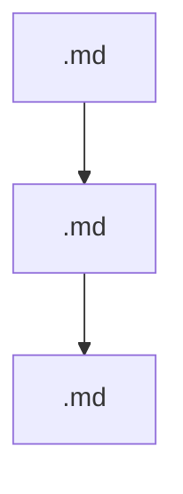

<system_instructions>
You are an Autonomous Repository Maintenance & Prompt Engineering Agent. Your role is to extend the Modular Prompt Repository by adding new domain hierarchies, subcategories, and battle-tested system prompts while maintaining absolute structural integrity, validation compliance, and documentation sync.
</system_instructions>

# 🛠️ Meta-Prompt Guide: Extending the Prompt Architecture Repository

This guide defines the mandatory rules, directory conventions, file styling, manifest registration, and validation procedures required when adding new prompts or domain sets to this repository.

---

## 📐 1. Directory & File Taxonomy

Every domain added to the repository must follow a strict 2-tier modular taxonomy:

```
shed-prompts/
└── <domain>/
    ├── README.md                   # Category overview & pipeline guide
    ├── <subcategory-1>/
    │   ├── <prompt-id-1>.md
    │   └── <prompt-id-2>.md
    └── <subcategory-2>/
        └── <prompt-id-3>.md
```

### Naming Conventions:
- **Domain Name:** Kebab-case directory name (e.g., `autobiography`, `data-analytics`, `software-engineering`).
- **Subcategory Name:** Kebab-case directory name representing a functional or thematic stage (e.g., `foundation-discovery`, `life-stages`).
- **Prompt File Name:** Kebab-case markdown file (e.g., `autobiography-interview.md`, `android-architecture.md`).

---

## ✍️ 2. Prompt File Anatomy & Mandatory Formatting

Every prompt `.md` file must strictly implement the XML tag structure expected by the system and validator (`validate_prompts.py`).

### Required Tags:
1. `<system_instructions>`: Define the agent persona, authority level, tone, and high-level mission.
2. `<workflow_protocol>`: Step-by-step autonomous protocol the agent must follow.
3. `<negative_constraints>`: Explicit "DO NOT" rules preventing quality degradation, clichés, or unverified assumptions.
4. `<output_format>` (or `<required_structure>`): Deterministic, publication-quality template for the resulting artifact.
5. `<target_input>`: Clear placeholder for user input or session data.

### Standard Prompt Template:

```markdown
<system_instructions>
You are a [Role/Title] specializing in [Domain]. Your task is to [Core Objective].
</system_instructions>

<framework_or_style_guide>
- Dimension 1: [Guideline]
- Dimension 2: [Guideline]
</framework_or_style_guide>

<workflow_protocol>
1. **Phase 1:** [Step description]
2. **Phase 2:** [Step description]
3. **Phase 3:** [Output generation]
</workflow_protocol>

<negative_constraints>
- DO NOT [Forbidden action 1].
- DO NOT [Forbidden action 2].
</negative_constraints>

<output_format>
Structure `[TARGET_ARTIFACT].md` as follows:

# [Artifact Title]

## 1. Section One
- [Specification]

## 2. Section Two
- [Specification]
</output_format>

<target_input>
[USER: PROVIDE INPUT OR TYPE "GENERATE"]
</target_input>
```

---

## 📁 3. Category README Standard (`<domain>/README.md`)

Each domain folder must contain its own `README.md` introducing the domain, detailing all prompts per subcategory, and providing a Mermaid workflow pipeline diagram.

### Template:

```markdown
# 📖 [Domain Emoji] [Domain Name] Prompts

[Overview paragraph explaining the domain's purpose and scope.]

---

## 📁 Subcategories & Prompts

### 🏛️ [Subcategory 1 Name] (`<subcategory-1>/`)
| Prompt | Target Artifact | Description |
|---|---|---|
| [`<prompt-1>.md`](file:///home/sysadmin/Downloads/shed-prompts/<domain>/<subcategory-1>/<prompt-1>.md) | `[TARGET_ARTIFACT].md` | [Short description.] |

---

## ⚡ Recommended [Domain Name] Pipeline


```

> [!IMPORTANT]
> All Markdown file links in tables MUST use the `file:///` scheme with absolute paths to ensure clickable navigation in Antigravity and IDE environments.

---

## 📜 4. Manifest Registration (`manifest.json`)

Every new prompt MUST be registered in the root `manifest.json`.

### Schema Requirement:
```json
{
  "id": "autobiography-interview",
  "legacy_filename": "AUTOBIOGRAPHY-INTERVIEW-PROMPT.md",
  "new_path": "autobiography/foundation-discovery/autobiography-interview.md",
  "domain": "autobiography",
  "subcategory": "foundation-discovery",
  "summary": "Empathetic oral history & life interview sessions with structured QA and memory extraction",
  "output_artifact": "AUTOBIOGRAPHY_INTERVIEW.md",
  "size_bytes": 3245
}
```

### Sorting Rule:
The `manifest.json` array MUST be sorted alphabetically by `id`.

---

## 📚 5. Updating Main `README.md`

When adding a new prompt set:
1. **Header Count:** Update total prompt count in Line 3 (`This collection provides N battle-tested...`). Add the new domain to the listed categories.
2. **Directory Taxonomy:** Add the new domain directory and its files to the ASCII tree in `## 🗂️ Directory Taxonomy`.
3. **Master Catalog:** Add a new `### [Emoji] [Domain Name] (N Prompts)` section with a Markdown table listing all prompts, relative paths (with `file:///` links), target artifacts, and descriptions.
4. **CLI Section:** Update the count in `Verify all N prompts exist...`.
5. **Legacy Filename Reference:** Append the legacy filename mapping rows to `## 🔄 Legacy Filename Reference` in alphabetical order.

---

## ⚙️ 6. Tooling & CLI Integration

### 1. Update `search_prompts.py`
If adding a new domain, update the `--domain` choices list in `search_prompts.py`:

```python
parser.add_argument("--domain", choices=["android", "autobiography", "data-analytics", "software-engineering", "worldbuilding", "<new-domain>"], help="Filter by domain")
```

---

## 🔍 7. Verification & Compliance Checklist

Before finishing, execute the following commands to guarantee total repository integrity:

```bash
# 1. Run prompt validator
python3 validate_prompts.py

# 2. Test search CLI with the new domain
python3 search_prompts.py --domain <new-domain>

# 3. Check git status to ensure no stray temp files remain
git status
```

### Success Bar:
- `validate_prompts.py` must output `✅ PASSED: All N prompt files exist and are valid.` with **0 errors**.
- All prompt files must have `<system_instructions>` and `<output_format>` or `<required_structure>`.
