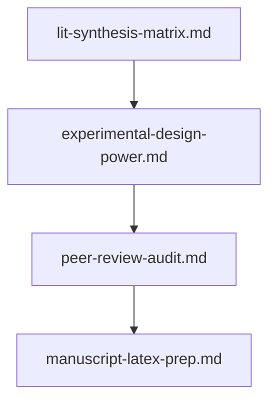

# 🔬 Scientific Method, Research & Academic Publishing Prompts

This module provides a systematic, publication-minded workflow for researchers, scientists, and academics moving from a pile of raw literature to a submission-ready manuscript. The prompts cover the full research lifecycle — ingesting dozens of papers into a comparable synthesis matrix, designing powered and confound-controlled experiments before data collection, surviving an unsparing "Reviewer #2" critique, and structuring raw findings into journal-specific LaTeX with publication-ready captions and citations.

---

## 📋 Table of Contents
- [📁 Subcategories & Prompts](#-subcategories--prompts)
  - [📚 Literature Synthesis & Claim Extraction (`lit-synthesis/`)](#subcat-lit-synthesis) ([`📁 lit-synthesis/`](file:///home/sysadmin/Downloads/shed-prompts/academic-research/lit-synthesis/))
  - [🧪 Experimental Design & Power Analysis (`experimental-design/`)](#subcat-experimental-design) ([`📁 experimental-design/`](file:///home/sysadmin/Downloads/shed-prompts/academic-research/experimental-design/))
  - [⚔️ Brutal Peer Review Pass (`peer-review-audit/`)](#subcat-peer-review-audit) ([`📁 peer-review-audit/`](file:///home/sysadmin/Downloads/shed-prompts/academic-research/peer-review-audit/))
  - [📝 Manuscript & LaTeX Structuring (`manuscript-prep/`)](#subcat-manuscript-prep) ([`📁 manuscript-prep/`](file:///home/sysadmin/Downloads/shed-prompts/academic-research/manuscript-prep/))
- [⚡ Recommended Academic Research Pipeline](#pipeline)

---

## 📁 Subcategories & Prompts

### 📚 Literature Synthesis & Claim Extraction (`lit-synthesis/`)
| Prompt | Target Artifact | Description |
|---|---|---|
| [`lit-synthesis-matrix.md`](file:///home/sysadmin/Downloads/shed-prompts/academic-research/lit-synthesis/lit-synthesis-matrix.md) | `LIT_SYNTHESIS_MATRIX.md` | Ingesting paper abstracts/summaries to produce a traceable matrix comparing methodologies, sample sizes, constraints, and conflicting results. |
| [`research-gap-finder.md`](file:///home/sysadmin/Downloads/shed-prompts/academic-research/lit-synthesis/research-gap-finder.md) | `RESEARCH_GAP_ANALYSIS.md` | Autonomous domain research gap detector, novelty analysis, and high-impact hypothesis generator for academic literature. |
| `[lit-synthesis-gap-tracker.md](file:///home/sysadmin/Downloads/shed-prompts/academic-research/lit-synthesis/lit-synthesis-gap-tracker.md)` | `LIT_SYNTHESIS_GAP_TRACKER.md` | Autonomous literature gap and contradiction clustering tracker. |
| `[lit-synthesis-citation-network.md](file:///home/sysadmin/Downloads/shed-prompts/academic-research/lit-synthesis/lit-synthesis-citation-network.md)` | `LIT_SYNTHESIS_CITATION_NETWORK.md` | Autonomous citation-network reconstruction and anomaly detection. |

[⬆ Back to Top](#top)

---

### 🧪 Experimental Design & Power Analysis (`experimental-design/`)
| Prompt | Target Artifact | Description |
|---|---|---|
| [`experimental-design-power.md`](file:///home/sysadmin/Downloads/shed-prompts/academic-research/experimental-design/experimental-design-power.md) | `EXPERIMENTAL_DESIGN.md` | Defining control/treatment groups, confounding variables, sample-size justification, and statistical test recommendations before collecting data. |
| `[experimental-design-replication-auditor.md](file:///home/sysadmin/Downloads/shed-prompts/academic-research/experimental-design/experimental-design-replication-auditor.md)` | `EXPERIMENTAL_DESIGN_REPLICATION_AUDIT.md` | Autonomous replication-crisis auditor scoring protocol reproducibility and missing controls. |

[⬆ Back to Top](#top)

---

### ⚔️ Brutal Peer Review Pass (`peer-review-audit/`)
| Prompt | Target Artifact | Description |
|---|---|---|
| [`peer-review-audit.md`](file:///home/sysadmin/Downloads/shed-prompts/academic-research/peer-review-audit/peer-review-audit.md) | `PEER_REVIEW_AUDIT.md` | Acting as an unsparing "Reviewer #2" to attack methodology flaws, unbacked assertions, statistical overreach, and missing citations. |
| `[peer-review-statistics-auditor.md](file:///home/sysadmin/Downloads/shed-prompts/academic-research/peer-review-audit/peer-review-statistics-auditor.md)` | `PEER_REVIEW_STATISTICS_AUDITOR.md` | Autonomous statistics-focused peer-review audit. |

[⬆ Back to Top](#top)

---

### 📝 Manuscript & LaTeX Structuring (`manuscript-prep/`)
| Prompt | Target Artifact | Description |
|---|---|---|
| [`manuscript-latex-prep.md`](file:///home/sysadmin/Downloads/shed-prompts/academic-research/manuscript-prep/manuscript-latex-prep.md) | `MANUSCRIPT.md` | Formatting raw findings into journal-specific IMRaD structures with publication-ready figure captions and citations. |
| `[manuscript-figure-caption-auditor.md](file:///home/sysadmin/Downloads/shed-prompts/academic-research/manuscript-prep/manuscript-figure-caption-auditor.md)` | `MANUSCRIPT_FIGURE_CAPTION_AUDITOR.md` | Autonomous figure caption and statistical-honesty auditor. |

---

[⬆ Back to Top](#top)

---

## ⚡ Recommended Academic Research Pipeline

    Z0["experimental-design-replication-auditor.md"]
    Z1["lit-synthesis-gap-tracker.md"]
    Z0 --> Z1
    Z2["lit-synthesis-citation-network.md"]
    Z1 --> Z2
    Z3["manuscript-figure-caption-auditor.md"]
    Z2 --> Z3
    Z4["peer-review-statistics-auditor.md"]
    Z3 --> Z4

[⬆ Back to Top](#top)
