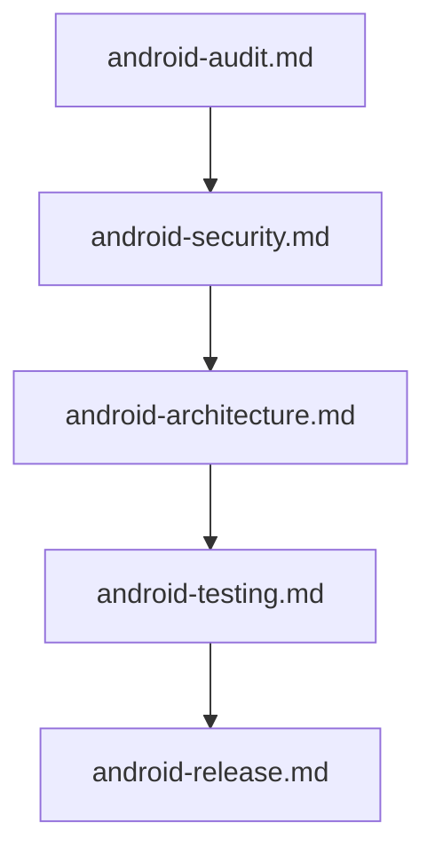

# 📱 Android Mobile Engineering Prompts

This module contains specialized prompts for Android mobile development, targeting Kotlin/Java, Jetpack Compose, View System, and Gradle environments.

---

## 📁 Subcategories & Prompts

### 🏛️ Architecture & Refactoring (`architecture-refactoring/`)
| Prompt | Target Artifact | Description |
|---|---|---|
| [`android-architecture.md`](file:///home/sysadmin/Downloads/shed-prompts/android/architecture-refactoring/android-architecture.md) | `ANDROID_ARCHITECTURE.md` | Process death, configuration change, and lifecycle state management architecture. |
| [`android-migration.md`](file:///home/sysadmin/Downloads/shed-prompts/android/architecture-refactoring/android-migration.md) | `ANDROID_MIGRATION.md` | SDK version upgrades, Kotlin/Compose migrations, and major library contract updates. |

### 🔒 Quality & Security (`quality-security/`)
| Prompt | Target Artifact | Description |
|---|---|---|
| [`android-a11y.md`](file:///home/sysadmin/Downloads/shed-prompts/android/quality-security/android-a11y.md) | `ANDROID_A11Y.md` | WCAG 2.1 AA compliance audit & remediation via TalkBack, Switch Access & Voice Access. |
| [`android-audit.md`](file:///home/sysadmin/Downloads/shed-prompts/android/quality-security/android-audit.md) | `ANDROID_AUDIT.md` | Strict read-only code quality, leak risk, and efficiency audit. |
| [`android-permissions.md`](file:///home/sysadmin/Downloads/shed-prompts/android/quality-security/android-permissions.md) | `ANDROID_PERMISSIONS.md` | Least-privilege permissions and runtime privacy audit. |
| [`android-security.md`](file:///home/sysadmin/Downloads/shed-prompts/android/quality-security/android-security.md) | `ANDROID_SECURITY.md` | Application security, APK hardening, and vulnerability audit. |
| [`android-testing.md`](file:///home/sysadmin/Downloads/shed-prompts/android/quality-security/android-testing.md) | `ANDROID_TESTING.md` | Unit, instrumented, and UI testing suite coverage pass. |

### 🚀 Ops & Performance (`ops-performance/`)
| Prompt | Target Artifact | Description |
|---|---|---|
| [`android-dependency.md`](file:///home/sysadmin/Downloads/shed-prompts/android/ops-performance/android-dependency.md) | `ANDROID_DEPENDENCY_REPORT.md` | Gradle dependency updates, version catalog migrations, and security patches. |
| [`android-i18n.md`](file:///home/sysadmin/Downloads/shed-prompts/android/ops-performance/android-i18n.md) | `ANDROID_I18N.md` | Multi-locale string extraction, plural formatting, and RTL support. |
| [`android-observability.md`](file:///home/sysadmin/Downloads/shed-prompts/android/ops-performance/android-observability.md) | `ANDROID_OBSERVABILITY.md` | Crashlytics/Sentry telemetry, structured logging, and ANR tracing. |
| [`android-performance.md`](file:///home/sysadmin/Downloads/shed-prompts/android/ops-performance/android-performance.md) | `ANDROID_PERFORMANCE.md` | Frame rendering, cold start, memory leak, and battery profiling. |
| [`android-release.md`](file:///home/sysadmin/Downloads/shed-prompts/android/ops-performance/android-release.md) | `ANDROID_RELEASE.md` | Signed App Bundle (AAB) & APK release packaging and Play Store readiness. |

---

## ⚡ Recommended Android Pipeline

