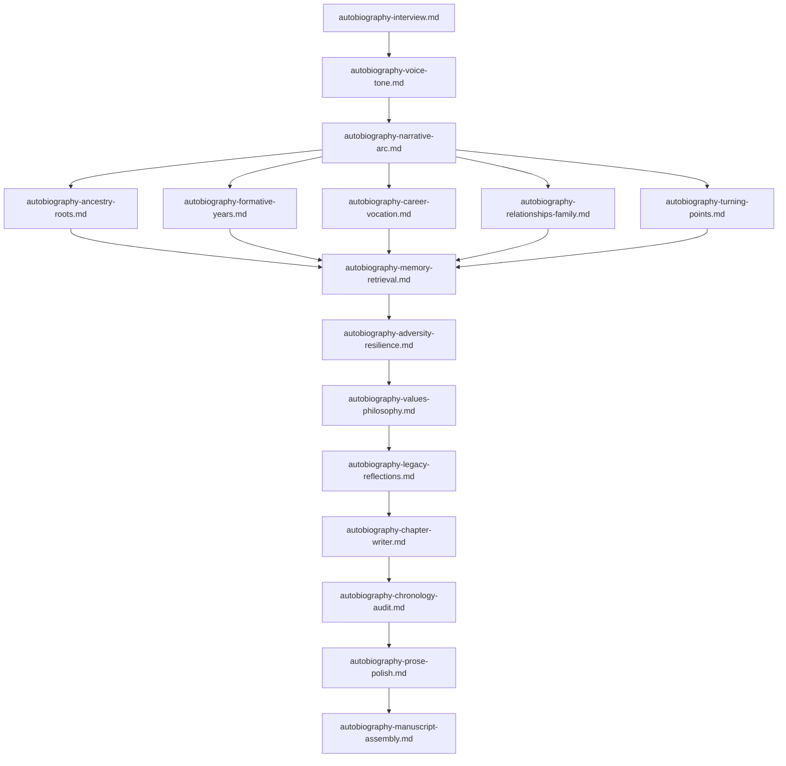

# 📖 Autobiography & Memoir Co-Creation Prompts

This module contains specialized, battle-tested system prompts designed to assist users in co-creating a full-length, publishing-quality autobiography or memoir. The prompts cover the entire narrative lifecycle — from oral history interviews and voice profiling to chronological life-stage dossiers, thematic refinement, chapter composition, continuity auditing, line editing, and final manuscript compilation.

---

## 📋 Table of Contents
- [📁 Subcategories & Prompts](#-subcategories--prompts)
  - [🔍 Foundations & Narrative Framing (`foundation-discovery/`)](#subcat-foundation-discovery) ([`📁 foundation-discovery/`](file:///home/sysadmin/Downloads/shed-prompts/autobiography/foundation-discovery/))
  - [⏳ Chronological & Life-Stage Eras (`life-stages/`)](#subcat-life-stages) ([`📁 life-stages/`](file:///home/sysadmin/Downloads/shed-prompts/autobiography/life-stages/))
  - [💡 Thematics & Deep Refinement (`thematics-refinement/`)](#subcat-thematics-refinement) ([`📁 thematics-refinement/`](file:///home/sysadmin/Downloads/shed-prompts/autobiography/thematics-refinement/))
  - [✍️ Prose Composition, Editing & Assembly (`crafting-polishing/`)](#subcat-crafting-polishing) ([`📁 crafting-polishing/`](file:///home/sysadmin/Downloads/shed-prompts/autobiography/crafting-polishing/))
- [⚡ Recommended Autobiography Creation Pipeline](#pipeline)

---

## 📁 Subcategories & Prompts

### 🔍 Foundations & Narrative Framing (`foundation-discovery/`)
| Prompt | Target Artifact | Description |
|---|---|---|
| [`autobiography-interview.md`](file:///home/sysadmin/Downloads/shed-prompts/autobiography/foundation-discovery/autobiography-interview.md) | `AUTOBIOGRAPHY_INTERVIEW.md` | Empathetic oral history & life interview sessions with structured QA and memory extraction. |
| [`autobiography-voice-tone.md`](file:///home/sysadmin/Downloads/shed-prompts/autobiography/foundation-discovery/autobiography-voice-tone.md) | `AUTOBIOGRAPHY_VOICE_TONE.md` | Defining author narrative voice, cadence, vocabulary, and linguistic style guide. |
| [`autobiography-narrative-arc.md`](file:///home/sysadmin/Downloads/shed-prompts/autobiography/foundation-discovery/autobiography-narrative-arc.md) | `AUTOBIOGRAPHY_NARRATIVE_ARC.md` | Master macro life narrative blueprint, themes, motifs, and act/chapter outline. |

[⬆ Back to Top](#top)

---

### ⏳ Chronological & Life-Stage Eras (`life-stages/`)
| Prompt | Target Artifact | Description |
|---|---|---|
| [`autobiography-ancestry-roots.md`](file:///home/sysadmin/Downloads/shed-prompts/autobiography/life-stages/autobiography-ancestry-roots.md) | `AUTOBIOGRAPHY_ANCESTRY_ROOTS.md` | Ancestral heritage, family lineage, cultural roots, and childhood environment dossier. |
| [`autobiography-formative-years.md`](file:///home/sysadmin/Downloads/shed-prompts/autobiography/life-stages/autobiography-formative-years.md) | `AUTOBIOGRAPHY_FORMATIVE_YEARS.md` | Youth, adolescence, education, coming of age, and early identity formation. |
| [`autobiography-career-vocation.md`](file:///home/sysadmin/Downloads/shed-prompts/autobiography/life-stages/autobiography-career-vocation.md) | `AUTOBIOGRAPHY_CAREER_VOCATION.md` | Professional journey, tradecraft mastery, leadership, career peaks, and setbacks. |
| [`autobiography-relationships-family.md`](file:///home/sysadmin/Downloads/shed-prompts/autobiography/life-stages/autobiography-relationships-family.md) | `AUTOBIOGRAPHY_RELATIONSHIPS_FAMILY.md` | Character portraits of partners, family, mentors, friends, and interpersonal dynamics. |
| [`autobiography-turning-points.md`](file:///home/sysadmin/Downloads/shed-prompts/autobiography/life-stages/autobiography-turning-points.md) | `AUTOBIOGRAPHY_TURNING_POINTS.md` | Watershed moments, crises, crossroads decisions, and transformational shifts. |

[⬆ Back to Top](#top)

---

### 💡 Thematics & Deep Refinement (`thematics-refinement/`)
| Prompt | Target Artifact | Description |
|---|---|---|
| [`autobiography-memory-retrieval.md`](file:///home/sysadmin/Downloads/shed-prompts/autobiography/thematics-refinement/autobiography-memory-retrieval.md) | `AUTOBIOGRAPHY_MEMORY_RETRIEVAL.md` | Sensory memory elicitation technique restoring sights, sounds, smells, and Somatic feel. |
| [`autobiography-adversity-resilience.md`](file:///home/sysadmin/Downloads/shed-prompts/autobiography/thematics-refinement/autobiography-adversity-resilience.md) | `AUTOBIOGRAPHY_ADVERSITY_RESILIENCE.md` | Deep exploration of hardship, grief, illness, vulnerability, and hard-won strength. |
| [`autobiography-values-philosophy.md`](file:///home/sysadmin/Downloads/shed-prompts/autobiography/thematics-refinement/autobiography-values-philosophy.md) | `AUTOBIOGRAPHY_VALUES_PHILOSOPHY.md` | Articulating personal philosophy, core values codex, and tested rules for living. |
| [`autobiography-legacy-reflections.md`](file:///home/sysadmin/Downloads/shed-prompts/autobiography/thematics-refinement/autobiography-legacy-reflections.md) | `AUTOBIOGRAPHY_LEGACY_REFLECTIONS.md` | Present-day reflections, letter to future generations, epilogue vision, and gratitude. |

[⬆ Back to Top](#top)

---

### ✍️ Prose Composition, Editing & Assembly (`crafting-polishing/`)
| Prompt | Target Artifact | Description |
|---|---|---|
| [`autobiography-chapter-writer.md`](file:///home/sysadmin/Downloads/shed-prompts/autobiography/crafting-polishing/autobiography-chapter-writer.md) | `AUTOBIOGRAPHY_CHAPTER.md` | Full chapter prose composition synthesizing interview notes into rich narrative arc. |
| [`autobiography-chronology-audit.md`](file:///home/sysadmin/Downloads/shed-prompts/autobiography/crafting-polishing/autobiography-chronology-audit.md) | `AUTOBIOGRAPHY_CHRONOLOGY_AUDIT.md` | Read-only timeline, age/date verification, fact-checking, and continuity audit. |
| [`autobiography-prose-polish.md`](file:///home/sysadmin/Downloads/shed-prompts/autobiography/crafting-polishing/autobiography-prose-polish.md) | `AUTOBIOGRAPHY_PROSE_POLISH.md` | Line editing, sensory enhancement, pacing, rhythm, and stylistic refinement. |
| [`autobiography-manuscript-assembly.md`](file:///home/sysadmin/Downloads/shed-prompts/autobiography/crafting-polishing/autobiography-manuscript-assembly.md) | `AUTOBIOGRAPHY_MANUSCRIPT_ASSEMBLY.md` | Full manuscript compilation, front/back matter, photo index, and production readiness. |
| [`autobiography-theme-extractor.md`](file:///home/sysadmin/Downloads/shed-prompts/autobiography/crafting-polishing/autobiography-theme-extractor.md) | `AUTOBIOGRAPHY_THEME_INDEX.md` | Autonomous motif and emotional theme extractor across memoir chapters, transcripts, and personal notes. |

---

[⬆ Back to Top](#top)

---

## ⚡ Recommended Autobiography Creation Pipeline

[⬆ Back to Top](#top)
