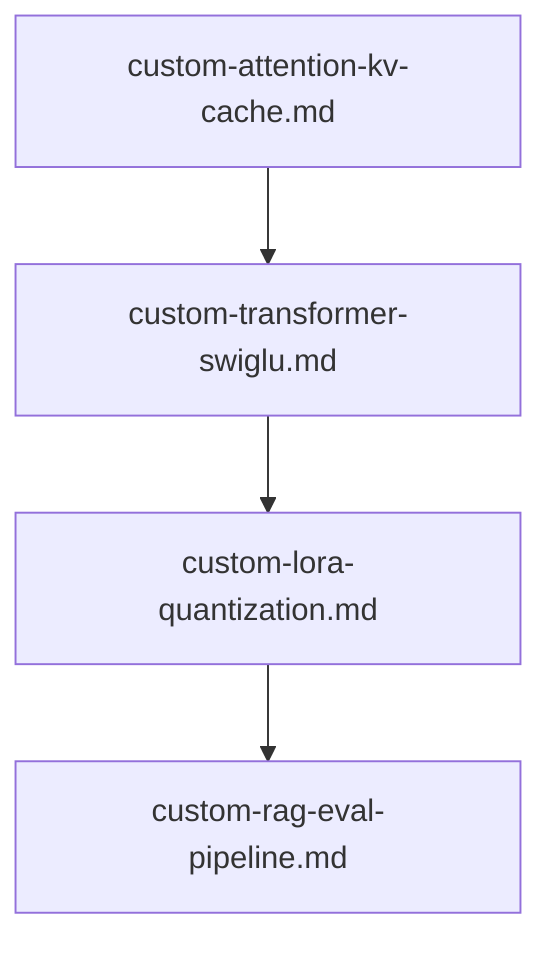

# 📖 🧠 Custom AI Model Architecture & LLM Engineering Prompts

This module contains specialized prompts for designing and constructing custom AI components, LLM architectures, fine-tuning protocols, and evaluation systems as fully executable `.ipynb` Jupyter notebooks in PyTorch and HuggingFace.

---

## 📋 Table of Contents
- [📁 Subcategories & Prompts](#-subcategories--prompts)
  - [🏛️ Model Architecture (`model-architecture/`)](#subcat-model-architecture) ([`📁 model-architecture/`](file:///home/sysadmin/Downloads/shed-prompts/custom-ai/model-architecture/))
  - [⚡ Fine-Tuning & Quantization (`fine-tuning-quantization/`)](#subcat-fine-tuning-quantization) ([`📁 fine-tuning-quantization/`](file:///home/sysadmin/Downloads/shed-prompts/custom-ai/fine-tuning-quantization/))
  - [🔍 RAG & Evaluation (`rag-evaluation/`)](#subcat-rag-evaluation) ([`📁 rag-evaluation/`](file:///home/sysadmin/Downloads/shed-prompts/custom-ai/rag-evaluation/))
- [⚡ Recommended Custom AI Pipeline](#pipeline)

---

## 📁 Subcategories & Prompts

### 🏛️ Model Architecture (`model-architecture/`)
| Prompt | Target Artifact | Description |
|---|---|---|
| [`custom-attention-kv-cache.md`](file:///home/sysadmin/Downloads/shed-prompts/custom-ai/model-architecture/custom-attention-kv-cache.md) | `CUSTOM_ATTENTION_KV_CACHE_NOTEBOOK.ipynb` | Multi-Head/Grouped-Query Attention (GQA), RoPE positional encoding, and KV cache mechanism in PyTorch. |
| [`custom-transformer-swiglu.md`](file:///home/sysadmin/Downloads/shed-prompts/custom-ai/model-architecture/custom-transformer-swiglu.md) | `CUSTOM_TRANSFORMER_SWIGLU_NOTEBOOK.ipynb` | SwiGLU MLP activation, RMSNorm, residual connections, and modern LLM decoder block pipeline in PyTorch. |
| `[custom-attention-benchmark.md](file:///home/sysadmin/Downloads/shed-prompts/custom-ai/model-architecture/custom-attention-benchmark.md)` | `CUSTOM_ATTENTION_BENCHMARK.md` | Autonomous attention-variant latency/memory/quality benchmark. |

[⬆ Back to Top](#top)

---

### ⚡ Fine-Tuning & Quantization (`fine-tuning-quantization/`)
| Prompt | Target Artifact | Description |
|---|---|---|
| [`custom-lora-quantization.md`](file:///home/sysadmin/Downloads/shed-prompts/custom-ai/fine-tuning-quantization/custom-lora-quantization.md) | `CUSTOM_LORA_QUANTIZATION_NOTEBOOK.ipynb` | Custom LoRA matrix injection, bitsandbytes 4-bit NF4 quantization, and PEFT fine-tuning loop pipeline. |
| [`custom-llm-fine-tuning-dataset-curator.md`](file:///home/sysadmin/Downloads/shed-prompts/custom-ai/fine-tuning-quantization/custom-llm-fine-tuning-dataset-curator.md) | `CUSTOM_DATASET_CURATION_REPORT.md` | Autonomous instruction tuning dataset curator, perplexity filter, and synthetic prompt quality auditor. |
| `[custom-quantization-loss-analyzer.md](file:///home/sysadmin/Downloads/shed-prompts/custom-ai/fine-tuning-quantization/custom-quantization-loss-analyzer.md)` | `CUSTOM_QUANTIZATION_LOSS_ANALYZER.md` | Autonomous quantization loss and degradation analyzer. |
| `[custom-dataset-dedup-auditor.md](file:///home/sysadmin/Downloads/shed-prompts/custom-ai/fine-tuning-quantization/custom-dataset-dedup-auditor.md)` | `CUSTOM_DATASET_DEDUP_AUDITOR.md` | Autonomous dataset deduplication and leakage auditor. |

[⬆ Back to Top](#top)

---

### 🔍 RAG & Evaluation (`rag-evaluation/`)
| Prompt | Target Artifact | Description |
|---|---|---|
| [`custom-rag-eval-pipeline.md`](file:///home/sysadmin/Downloads/shed-prompts/custom-ai/rag-evaluation/custom-rag-eval-pipeline.md) | `CUSTOM_RAG_EVAL_NOTEBOOK.ipynb` | Dense + BM25 hybrid retrieval, Reciprocal Rank Fusion, Cross-Encoder re-ranking, and Ragas evaluation pipeline. |
| `[custom-rag-hallucination-auditor.md](file:///home/sysadmin/Downloads/shed-prompts/custom-ai/rag-evaluation/custom-rag-hallucination-auditor.md)` | `CUSTOM_RAG_HALLUCINATION_AUDITOR.md` | Autonomous RAG grounding and hallucination auditor. |
| `[custom-rag-retrieval-coverage.md](file:///home/sysadmin/Downloads/shed-prompts/custom-ai/rag-evaluation/custom-rag-retrieval-coverage.md)` | `CUSTOM_RAG_RETRIEVAL_COVERAGE.md` | Autonomous RAG retrieval coverage and hole auditor. |

---

[⬆ Back to Top](#top)

---

## ⚡ Recommended Custom AI Pipeline

    Z0["custom-rag-hallucination-auditor.md"]
    Z1["custom-quantization-loss-analyzer.md"]
    Z0 --> Z1
    Z2["custom-attention-benchmark.md"]
    Z1 --> Z2
    Z3["custom-dataset-dedup-auditor.md"]
    Z2 --> Z3
    Z4["custom-rag-retrieval-coverage.md"]
    Z3 --> Z4

[⬆ Back to Top](#top)
