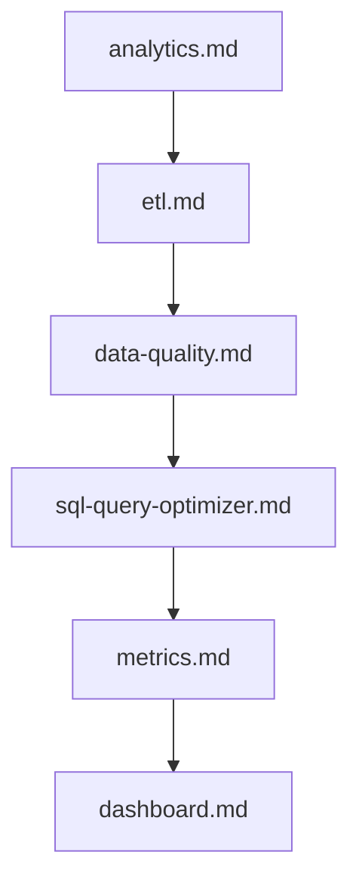

# 📊 Data Analytics & Engineering Prompts

This module provides specialized prompts for data analytics engineering, SQL query optimization, data quality auditing, ETL pipeline construction, metrics definition, A/B experimentation, financial optimization (FinOps), and visualization dashboards.

---

## 📋 Table of Contents
- [📁 Subcategories & Prompts](#-subcategories--prompts)
  - [🛠️ Analytics Engineering (`analytics-engineering/`)](#subcat-analytics-engineering) ([`📁 analytics-engineering/`](file:///home/sysadmin/Downloads/shed-prompts/data-analytics/analytics-engineering/))
  - [🧪 Experimentation & Reporting (`experimentation/`)](#subcat-experimentation) ([`📁 experimentation/`](file:///home/sysadmin/Downloads/shed-prompts/data-analytics/experimentation/))
  - [💰 FinOps & Cost Optimization (`finops/`)](#subcat-finops) ([`📁 finops/`](file:///home/sysadmin/Downloads/shed-prompts/data-analytics/finops/))
  - [📈 Visualization & Dashboards (`visualization/`)](#subcat-visualization) ([`📁 visualization/`](file:///home/sysadmin/Downloads/shed-prompts/data-analytics/visualization/))
- [⚡ Recommended Data Analytics Pipeline](#pipeline)

---

## 📁 Subcategories & Prompts

### 🛠️ Analytics Engineering (`analytics-engineering/`)
| Prompt | Target Artifact | Description |
|---|---|---|
| [`analytics.md`](file:///home/sysadmin/Downloads/shed-prompts/data-analytics/analytics-engineering/analytics.md) | `ANALYTICS_SPEC.md` | Dimensional modeling, star schema architecture, and dbt project structure. |
| [`data-quality.md`](file:///home/sysadmin/Downloads/shed-prompts/data-analytics/analytics-engineering/data-quality.md) | `DATA_QUALITY_SUITE.md` | Data profiling, fresh checks, anomaly detection, and Great Expectations assertions. |
| [`etl.md`](file:///home/sysadmin/Downloads/shed-prompts/data-analytics/analytics-engineering/etl.md) | `ETL_PIPELINE.md` | Idempotent data ingestion pipelines, Airflow DAGs, and backfill execution protocols. |
| [`metrics.md`](file:///home/sysadmin/Downloads/shed-prompts/data-analytics/analytics-engineering/metrics.md) | `METRICS_CATALOG.md` | Semantic layer metric definitions, KPI lineage, and dbt Semantic Layer specs. |
| [`sql-query-optimizer.md`](file:///home/sysadmin/Downloads/shed-prompts/data-analytics/analytics-engineering/sql-query-optimizer.md) | `SQL_QUERY_OPTIMIZATION_PLAN.md` | Autonomous SQL query performance profiler, CTE bottleneck analyzer, and zero-downtime index advisor. |

[⬆ Back to Top](#top)

---

### 🧪 Experimentation & Reporting (`experimentation/`)
| Prompt | Target Artifact | Description |
|---|---|---|
| [`ab-test.md`](file:///home/sysadmin/Downloads/shed-prompts/data-analytics/experimentation/ab-test.md) | `AB_TEST_SPEC.md` | A/B test design, sample size power calculations, variance reduction (CUPED), and novelty effect checks. |
| [`reporting.md`](file:///home/sysadmin/Downloads/shed-prompts/data-analytics/experimentation/reporting.md) | `EXECUTIVE_REPORT.md` | Automated executive reporting, automated variance analysis, and data storytelling. |

[⬆ Back to Top](#top)

---

### 💰 FinOps & Cost Optimization (`finops/`)
| Prompt | Target Artifact | Description |
|---|---|---|
| [`cost.md`](file:///home/sysadmin/Downloads/shed-prompts/data-analytics/finops/cost.md) | `CLOUD_FINOPS_AUDIT.md` | Cloud data warehouse cost optimization, Snowflake credit consumption reduction, and BigQuery slot allocation. |

[⬆ Back to Top](#top)

---

### 📈 Visualization & Dashboards (`visualization/`)
| Prompt | Target Artifact | Description |
|---|---|---|
| [`charting.md`](file:///home/sysadmin/Downloads/shed-prompts/data-analytics/visualization/charting.md) | `CHARTING_SPEC.md` | Chart type selection matrix, color accessibility, and UX visualization specs. |
| [`dashboard.md`](file:///home/sysadmin/Downloads/shed-prompts/data-analytics/visualization/dashboard.md) | `DASHBOARD_BLUEPRINT.md` | Executive and operational dashboard layout, filter hierarchy, and interactive drill-downs. |

---

[⬆ Back to Top](#top)

---

## ⚡ Recommended Data Analytics Pipeline

[⬆ Back to Top](#top)
