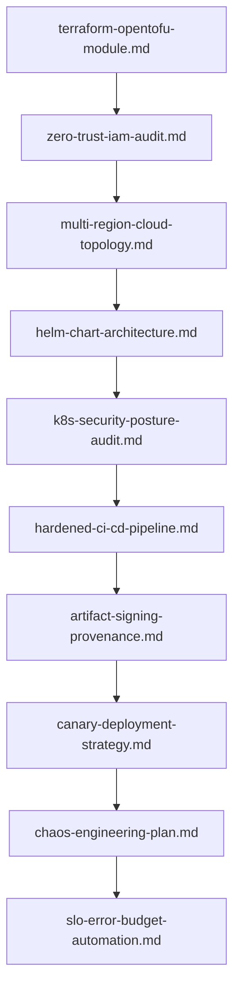

# 🚀 DevOps, Cloud Infrastructure & SRE Prompts

This module provides specialized, production-grade system prompts for DevOps engineering, Cloud Infrastructure, Kubernetes orchestration, CI/CD pipeline security, and Site Reliability Engineering (SRE).

---

## 📋 Table of Contents
- [📁 Subcategories & Prompts](#-subcategories--prompts)
  - [🏗️ Infrastructure as Code (`infrastructure-as-code/`)](#subcat-infrastructure-as-code) ([`📁 infrastructure-as-code/`](file:///home/sysadmin/Downloads/shed-prompts/devops-sre/infrastructure-as-code/))
  - [📦 Container & Kubernetes Orchestration (`container-k8s/`)](#subcat-container-k8s) ([`📁 container-k8s/`](file:///home/sysadmin/Downloads/shed-prompts/devops-sre/container-k8s/))
  - [⚡ CI/CD & Release Automation (`pipeline-automation/`)](#subcat-pipeline-automation) ([`📁 pipeline-automation/`](file:///home/sysadmin/Downloads/shed-prompts/devops-sre/pipeline-automation/))
  - [🛡️ Reliability & Disaster Recovery (`resilience-recovery/`)](#subcat-resilience-recovery) ([`📁 resilience-recovery/`](file:///home/sysadmin/Downloads/shed-prompts/devops-sre/resilience-recovery/))
- [⚡ Recommended DevOps & SRE Pipeline](#pipeline)

---

## 📁 Subcategories & Prompts

### 🏗️ Infrastructure as Code (`infrastructure-as-code/`)
| Prompt | Target Artifact | Description |
|---|---|---|
| [`terraform-opentofu-module.md`](file:///home/sysadmin/Downloads/shed-prompts/devops-sre/infrastructure-as-code/terraform-opentofu-module.md) | `TERRAFORM_OPENTOFU_MODULE_SPEC.md` | Production Terraform/OpenTofu module architecture, variable validation, and state isolation design. |
| [`multi-region-cloud-topology.md`](file:///home/sysadmin/Downloads/shed-prompts/devops-sre/infrastructure-as-code/multi-region-cloud-topology.md) | `MULTI_REGION_CLOUD_TOPOLOGY.md` | Multi-region cloud infrastructure topology specification, active-active networking, and VPC peering design. |
| [`zero-trust-iam-audit.md`](file:///home/sysadmin/Downloads/shed-prompts/devops-sre/infrastructure-as-code/zero-trust-iam-audit.md) | `ZERO_TRUST_IAM_AUDIT.md` | Zero-Trust IAM security policy auditor, least-privilege role deconstruction, and privilege escalation detector. |
| [`iac-drift-remediation-audit.md`](file:///home/sysadmin/Downloads/shed-prompts/devops-sre/infrastructure-as-code/iac-drift-remediation-audit.md) | `IAC_DRIFT_REMEDIATION_PLAN.md` | Autonomous Infrastructure as Code state drift detector, manual change scanner, and automated terraform import generator. |

[⬆ Back to Top](#top)

---

### 📦 Container & Kubernetes Orchestration (`container-k8s/`)
| Prompt | Target Artifact | Description |
|---|---|---|
| [`helm-chart-architecture.md`](file:///home/sysadmin/Downloads/shed-prompts/devops-sre/container-k8s/helm-chart-architecture.md) | `HELM_CHART_ARCHITECTURE.md` | Production Helm v3 chart architecture, value schema validation, and multi-environment override design. |
| [`k8s-autoscaling-resource-tuning.md`](file:///home/sysadmin/Downloads/shed-prompts/devops-sre/container-k8s/k8s-autoscaling-resource-tuning.md) | `K8S_AUTOSCALING_TUNING_SPEC.md` | Kubernetes HPA/VPA autoscaling policies, pod resource request/limit profiling, and OOMKilled risk reduction. |
| [`ingress-service-mesh-config.md`](file:///home/sysadmin/Downloads/shed-prompts/devops-sre/container-k8s/ingress-service-mesh-config.md) | `INGRESS_SERVICE_MESH_SPEC.md` | Ingress controller and Istio/Linkerd service mesh configuration, mTLS enforcement, and traffic routing policy. |
| [`k8s-security-posture-audit.md`](file:///home/sysadmin/Downloads/shed-prompts/devops-sre/container-k8s/k8s-security-posture-audit.md) | `K8S_SECURITY_POSTURE_AUDIT.md` | Autonomous Kubernetes cluster security posture auditor, RBAC privilege escalation scanner, and pod security standard verifier. |

[⬆ Back to Top](#top)

---

### ⚡ CI/CD & Release Automation (`pipeline-automation/`)
| Prompt | Target Artifact | Description |
|---|---|---|
| [`hardened-ci-cd-pipeline.md`](file:///home/sysadmin/Downloads/shed-prompts/devops-sre/pipeline-automation/hardened-ci-cd-pipeline.md) | `HARDENED_CI_CD_PIPELINE.md` | Hardened GitHub Actions / GitLab CI workflow architecture, OIDC secretless auth, and runner isolation spec. |
| [`canary-deployment-strategy.md`](file:///home/sysadmin/Downloads/shed-prompts/devops-sre/pipeline-automation/canary-deployment-strategy.md) | `CANARY_DEPLOYMENT_STRATEGY.md` | Zero-downtime canary and progressive traffic shifting deployment strategy with automated rollback metrics. |
| [`artifact-signing-provenance.md`](file:///home/sysadmin/Downloads/shed-prompts/devops-sre/pipeline-automation/artifact-signing-provenance.md) | `ARTIFACT_SIGNING_PROVENANCE.md` | Automated container & binary artifact signing, Cosign verification, and SLSA provenance attestation architecture. |
| [`pipeline-vulnerability-containment.md`](file:///home/sysadmin/Downloads/shed-prompts/devops-sre/pipeline-automation/pipeline-vulnerability-containment.md) | `PIPELINE_VULNERABILITY_CONTAINMENT.md` | Autonomous CI/CD pipeline supply chain threat scanner, secret leak auditor, and dependency poisoning defense engine. |

[⬆ Back to Top](#top)

---

### 🛡️ Reliability & Disaster Recovery (`resilience-recovery/`)
| Prompt | Target Artifact | Description |
|---|---|---|
| [`chaos-engineering-plan.md`](file:///home/sysadmin/Downloads/shed-prompts/devops-sre/resilience-recovery/chaos-engineering-plan.md) | `CHAOS_ENGINEERING_PLAN.md` | Chaos engineering experiment design, blast radius control, fault injection hypothesis, and steady-state validation. |
| [`multi-az-failover-runbook.md`](file:///home/sysadmin/Downloads/shed-prompts/devops-sre/resilience-recovery/multi-az-failover-runbook.md) | `MULTI_AZ_FAILOVER_RUNBOOK.md` | Multi-AZ and multi-region automated failover runbook, DNS failover routing, and database split-brain defense. |
| [`rto-rpo-disaster-recovery-audit.md`](file:///home/sysadmin/Downloads/shed-prompts/devops-sre/resilience-recovery/rto-rpo-disaster-recovery-audit.md) | `RTO_RPO_DISASTER_RECOVERY_AUDIT.md` | RTO/RPO disaster recovery audit, snapshot replication verifier, and cold/warm/hot restore protocol test. |
| [`slo-error-budget-automation.md`](file:///home/sysadmin/Downloads/shed-prompts/devops-sre/resilience-recovery/slo-error-budget-automation.md) | `SLO_ERROR_BUDGET_REPORT.md` | Autonomous SRE Service Level Objective (SLO) tracker, error budget burn rate analyzer, and deployment freeze advisory. |

---

[⬆ Back to Top](#top)

---

## ⚡ Recommended DevOps & SRE Pipeline

[⬆ Back to Top](#top)
