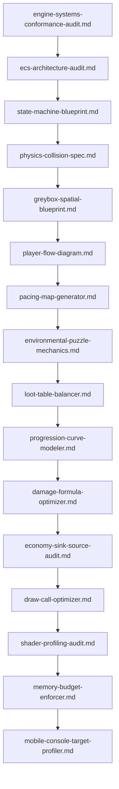

# 🕹️ Game Development & Interactive Systems Prompts

This module bridges technical software engineering and creative worldbuilding/narrative design, providing production-grade system prompts for engine architecture, economy & combat balancing, level design, and graphics/frame optimization across Unity, Unreal, and Godot. Many prompts run fully autonomously with no user input required (type `GENERATE`).

---

## 📋 Table of Contents
- [📁 Subcategories & Prompts](#-subcategories--prompts)
  - [⚙️ Engine Architecture & Systems (`engine-systems/`)](#subcat-engine-systems) ([`📁 engine-systems/`](file:///home/sysadmin/Downloads/shed-prompts/game-development/engine-systems/))
  - [💰 Economy & Combat Balancing (`economy-balancing/`)](#subcat-economy-balancing) ([`📁 economy-balancing/`](file:///home/sysadmin/Downloads/shed-prompts/game-development/economy-balancing/))
  - [🗺️ Level Design & Environmental Mechanics (`level-design/`)](#subcat-level-design) ([`📁 level-design/`](file:///home/sysadmin/Downloads/shed-prompts/game-development/level-design/))
  - [🎨 Graphics & Frame Optimization (`graphics-performance/`)](#subcat-graphics-performance) ([`📁 graphics-performance/`](file:///home/sysadmin/Downloads/shed-prompts/game-development/graphics-performance/))
- [⚡ Recommended Game Development Pipeline](#pipeline)

---

## 📁 Subcategories & Prompts

### ⚙️ Engine Architecture & Systems (`engine-systems/`)
| Prompt | Target Artifact | Description |
|---|---|---|
| [`ecs-architecture-audit.md`](file:///home/sysadmin/Downloads/shed-prompts/game-development/engine-systems/ecs-architecture-audit.md) | `ECS_ARCHITECTURE_AUDIT.md` | Autonomous ECS architecture conformance auditor for Unity DOTS, Unreal Mass, and Godot — data layout, system isolation, and job safety. |
| [`state-machine-blueprint.md`](file:///home/sysadmin/Downloads/shed-prompts/game-development/engine-systems/state-machine-blueprint.md) | `STATE_MACHINE_BLUEPRINT.md` | Finite/hierarchical state machine blueprint with explicit transition tables, guards, and race resolution. |
| [`physics-collision-spec.md`](file:///home/sysadmin/Downloads/shed-prompts/game-development/engine-systems/physics-collision-spec.md) | `PHYSICS_COLLISION_SPEC.md` | Deterministic physics & collision spec: collider topology, layer/mask matrix, and solver budget. |
| [`engine-systems-conformance-audit.md`](file:///home/sysadmin/Downloads/shed-prompts/game-development/engine-systems/engine-systems-conformance-audit.md) | `ENGINE_SYSTEMS_CONFORMANCE_AUDIT.md` | Autonomous engine-level conformance auditor: update ordering, lifecycle leaks, and streaming symmetry. |

[⬆ Back to Top](#top)

---

### 💰 Economy & Combat Balancing (`economy-balancing/`)
| Prompt | Target Artifact | Description |
|---|---|---|
| [`loot-table-balancer.md`](file:///home/sysadmin/Downloads/shed-prompts/game-development/economy-balancing/loot-table-balancer.md) | `LOOT_TABLE_BALANCER.md` | Weighted, seed-deterministic loot tables with pity floors and manipulation defense. |
| [`progression-curve-modeler.md`](file:///home/sysadmin/Downloads/shed-prompts/game-development/economy-balancing/progression-curve-modeler.md) | `PROGRESSION_CURVE_MODELER.md` | Mathematically smooth XP/level curves with TTK-aligned power scaling and unlock cadence. |
| [`damage-formula-optimizer.md`](file:///home/sysadmin/Downloads/shed-prompts/game-development/economy-balancing/damage-formula-optimizer.md) | `DAMAGE_FORMULA_OPTIMIZER.md` | Bounded, monotonic damage formula with mitigation, crit, variance, and TTK solver. |
| [`economy-sink-source-audit.md`](file:///home/sysadmin/Downloads/shed-prompts/game-development/economy-balancing/economy-sink-source-audit.md) | `ECONOMY_SINK_SOURCE_AUDIT.md` | Autonomous economy sink/source auditor detecting inflation, dead sinks, and ratio breach. |

[⬆ Back to Top](#top)

---

### 🗺️ Level Design & Environmental Mechanics (`level-design/`)
| Prompt | Target Artifact | Description |
|---|---|---|
| [`greybox-spatial-blueprint.md`](file:///home/sysadmin/Downloads/shed-prompts/game-development/level-design/greybox-spatial-blueprint.md) | `GREYBOX_SPATIAL_BLUEPRINT.md` | Annotated greybox spatial blueprint with cover arcs, sightlines, and traversal paths. |
| [`environmental-puzzle-mechanics.md`](file:///home/sysadmin/Downloads/shed-prompts/game-development/level-design/environmental-puzzle-mechanics.md) | `ENVIRONMENTAL_PUZZLE_MECHANICS.md` | Diegetic puzzle mechanics with deterministic solve/fail states and soft-lock-free reset. |
| [`pacing-map-generator.md`](file:///home/sysadmin/Downloads/shed-prompts/game-development/level-design/pacing-map-generator.md) | `PACING_MAP_GENERATOR.md` | Tension-curve pacing map sequencing combat, exploration, and rest beats. |
| [`player-flow-diagram.md`](file:///home/sysadmin/Downloads/shed-prompts/game-development/level-design/player-flow-diagram.md) | `PLAYER_FLOW_DIAGRAM.md` | Player flow & decision-path diagram exposing friction, loops, and dead flow. |

[⬆ Back to Top](#top)

---

### 🎨 Graphics & Frame Optimization (`graphics-performance/`)
| Prompt | Target Artifact | Description |
|---|---|---|
| [`draw-call-optimizer.md`](file:///home/sysadmin/Downloads/shed-prompts/game-development/graphics-performance/draw-call-optimizer.md) | `DRAW_CALL_OPTIMIZER.md` | Draw-call reduction plan via batching, instancing, and state-change ordering. |
| [`shader-profiling-audit.md`](file:///home/sysadmin/Downloads/shed-prompts/game-development/graphics-performance/shader-profiling-audit.md) | `SHADER_PROFILING_AUDIT.md` | Autonomous HLSL/GLSL shader profiler: ALU, bandwidth, divergence, and precision. |
| [`memory-budget-enforcer.md`](file:///home/sysadmin/Downloads/shed-prompts/game-development/graphics-performance/memory-budget-enforcer.md) | `MEMORY_BUDGET_ENFORCER.md` | Autonomous runtime memory budget enforcer with per-platform caps and leak detection. |
| [`mobile-console-target-profiler.md`](file:///home/sysadmin/Downloads/shed-prompts/game-development/graphics-performance/mobile-console-target-profiler.md) | `MOBILE_CONSOLE_TARGET_PROFILER.md` | Autonomous mobile/console frame-budget, thermal, and dynamic-resolution profiler. |

---

[⬆ Back to Top](#top)

---

## ⚡ Recommended Game Development Pipeline

[⬆ Back to Top](#top)
