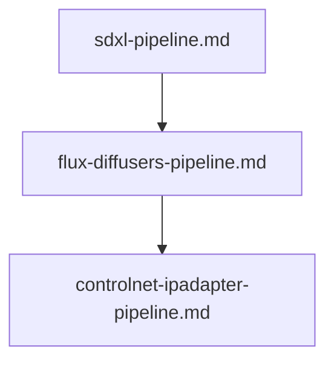

# 📖 🎨 Open-Weight Local Image Generation Prompts

This module contains specialized prompts for building local image generation, flow matching, and conditioned image synthesis pipelines as executable `.ipynb` Jupyter notebooks pulling models from HuggingFace (`diffusers`, `transformers`).

---

## 📋 Table of Contents
- [📁 Subcategories & Prompts](#-subcategories--prompts)
  - [🖼️ Diffusers Pipelines (`diffusers-pipelines/`)](#subcat-diffusers-pipelines) ([`📁 diffusers-pipelines/`](file:///home/sysadmin/Downloads/shed-prompts/image-generation/diffusers-pipelines/))
  - [🎯 Conditioned Generation (`conditioned-generation/`)](#subcat-conditioned-generation) ([`📁 conditioned-generation/`](file:///home/sysadmin/Downloads/shed-prompts/image-generation/conditioned-generation/))
- [⚡ Recommended Image Generation Pipeline](#pipeline)

---

## 📁 Subcategories & Prompts

### 🖼️ Diffusers Pipelines (`diffusers-pipelines/`)
| Prompt | Target Artifact | Description |
|---|---|---|
| [`sdxl-pipeline.md`](file:///home/sysadmin/Downloads/shed-prompts/image-generation/diffusers-pipelines/sdxl-pipeline.md) | `SDXL_DIFFUSERS_NOTEBOOK.ipynb` | SDXL Base + Refiner ensemble, Compel prompt weighting, and DPMSolver scheduler pipeline. |
| [`flux-diffusers-pipeline.md`](file:///home/sysadmin/Downloads/shed-prompts/image-generation/diffusers-pipelines/flux-diffusers-pipeline.md) | `FLUX_DIFFUSERS_NOTEBOOK.ipynb` | FLUX.1 [dev/schnell] flow matching pipeline with bitsandbytes NF4 quantization and CPU offloading. |
| [`prompt-expansion-matrix.md`](file:///home/sysadmin/Downloads/shed-prompts/image-generation/diffusers-pipelines/prompt-expansion-matrix.md) | `PROMPT_EXPANSION_MATRIX.md` | Autonomous prompt expander and aesthetic parameter generator for FLUX, SDXL, and Midjourney diffusion models. |
| `[image-lora-stack-composer.md](file:///home/sysadmin/Downloads/shed-prompts/image-generation/diffusers-pipelines/image-lora-stack-composer.md)` | `IMAGE_LORA_STACK_COMPOSER.md` | Autonomous multi-LoRA stacking composer and bleed checker. |

[⬆ Back to Top](#top)

---

### 🎯 Conditioned Generation (`conditioned-generation/`)
| Prompt | Target Artifact | Description |
|---|---|---|
| [`controlnet-ipadapter-pipeline.md`](file:///home/sysadmin/Downloads/shed-prompts/image-generation/conditioned-generation/controlnet-ipadapter-pipeline.md) | `CONTROLNET_IPADAPTER_NOTEBOOK.ipynb` | ControlNet Canny/OpenPose spatial control and IP-Adapter style steering diffusers pipeline. |
| `[image-controlnet-depth-auditor.md](file:///home/sysadmin/Downloads/shed-prompts/image-generation/conditioned-generation/image-controlnet-depth-auditor.md)` | `IMAGE_CONTROLNET_DEPTH_AUDITOR.md` | Autonomous ControlNet depth-fidelity auditor. |
| `[image-inpainting-mask-auditor.md](file:///home/sysadmin/Downloads/shed-prompts/image-generation/conditioned-generation/image-inpainting-mask-auditor.md)` | `IMAGE_INPAINTING_MASK_AUDITOR.md` | Autonomous inpainting mask localization and seam auditor. |

---

[⬆ Back to Top](#top)

---

## ⚡ Recommended Image Generation Pipeline

    Z0["image-controlnet-depth-auditor.md"]
    Z1["image-lora-stack-composer.md"]
    Z0 --> Z1
    Z2["image-inpainting-mask-auditor.md"]
    Z1 --> Z2

[⬆ Back to Top](#top)
