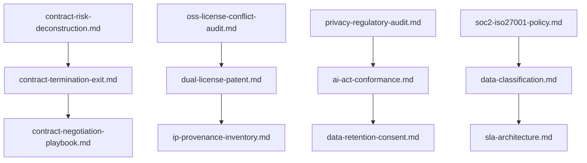

# ⚖️ Legal Tech, Regulatory Compliance & IP Audit Prompts

This domain brings rigorous, read-only audit and policy-authoring capabilities to legal agreements, open-source licensing, privacy regulation, and compliance frameworks. Every prompt operates as an autonomous agentic persona that surfaces risk, flags conflicts, and drafts enforceable artifacts — always deferring to qualified counsel for final legal sign-off.

---

## 📋 Table of Contents
- [📁 Subcategories & Prompts](#-subcategories--prompts)
  - [📜 Contract Risk & Liability Deconstruction (`contract-risk/`)](#subcat-contract-risk) ([`📁 contract-risk/`](file:///home/sysadmin/Downloads/shed-prompts/legal-compliance/contract-risk/))
  - [🛡️ AI & Privacy Regulatory Audit (`privacy-compliance/`)](#subcat-privacy-compliance) ([`📁 privacy-compliance/`](file:///home/sysadmin/Downloads/shed-prompts/legal-compliance/privacy-compliance/))
  - [📦 IP & Open-Source License Conflict Audit (`ip-licensing/`)](#subcat-ip-licensing) ([`📁 ip-licensing/`](file:///home/sysadmin/Downloads/shed-prompts/legal-compliance/ip-licensing/))
  - [📐 Security Policy & SLA Architecture (`policy-frameworks/`)](#subcat-policy-frameworks) ([`📁 policy-frameworks/`](file:///home/sysadmin/Downloads/shed-prompts/legal-compliance/policy-frameworks/))
- [⚡ Recommended Legal & Compliance Pipeline](#pipeline)

---

## 📁 Subcategories & Prompts

### 📜 Contract Risk & Liability Deconstruction (`contract-risk/`)
| Prompt | Target Artifact | Description |
|---|---|---|
| [`contract-risk-deconstruction.md`](file:///home/sysadmin/Downloads/shed-prompts/legal-compliance/contract-risk/contract-risk-deconstruction.md) | `CONTRACT_RISK_MATRIX.md` | Isolates indemnity traps, uncapped liabilities, termination & non-compete ambiguities into a ranked risk table. |
| [`contract-termination-exit.md`](file:///home/sysadmin/Downloads/shed-prompts/legal-compliance/contract-risk/contract-termination-exit.md) | `CONTRACT_TERMINATION_AUDIT.md` | Audits renewal, auto-renewal, exit penalties, and post-termination obligations. |
| [`contract-negotiation-playbook.md`](file:///home/sysadmin/Downloads/shed-prompts/legal-compliance/contract-risk/contract-negotiation-playbook.md) | `CONTRACT_NEGOTIATION_PLAYBOOK.md` | Converts audit findings into prioritized, redline-ready negotiation counters. |

[⬆ Back to Top](#top)

---

### 🛡️ AI & Privacy Regulatory Audit (`privacy-compliance/`)
| Prompt | Target Artifact | Description |
|---|---|---|
| [`privacy-regulatory-audit.md`](file:///home/sysadmin/Downloads/shed-prompts/legal-compliance/privacy-compliance/privacy-regulatory-audit.md) | `PRIVACY_COMPLIANCE_AUDIT.md` | Audits architecture against GDPR, CCPA/CPRA & EU AI Act for retention/consent gaps. |
| [`ai-act-conformance.md`](file:///home/sysadmin/Downloads/shed-prompts/legal-compliance/privacy-compliance/ai-act-conformance.md) | `AI_ACT_CONFORMANCE.md` | Classifies AI Act risk tier and scores obligation conformance. |
| [`data-retention-consent.md`](file:///home/sysadmin/Downloads/shed-prompts/legal-compliance/privacy-compliance/data-retention-consent.md) | `DATA_RETENTION_CONSENT_REPORT.md` | Audits retention schedules, consent capture, and withdrawal parity. |
| [`gdpr-dpia-assessment.md`](file:///home/sysadmin/Downloads/shed-prompts/legal-compliance/privacy-compliance/gdpr-dpia-assessment.md) | `GDPR_DPIA_ASSESSMENT.md` | Autonomous Data Protection Impact Assessment (DPIA) generator and privacy risk mitigation auditor. |

[⬆ Back to Top](#top)

---

### 📦 IP & Open-Source License Conflict Audit (`ip-licensing/`)
| Prompt | Target Artifact | Description |
|---|---|---|
| [`oss-license-conflict-audit.md`](file:///home/sysadmin/Downloads/shed-prompts/legal-compliance/ip-licensing/oss-license-conflict-audit.md) | `OSS_LICENSE_CONFLICT_AUDIT.md` | Detects GPL/AGPL/LGPL copyleft contamination vs. MIT/Apache distribution model. |
| [`dual-license-patent.md`](file:///home/sysadmin/Downloads/shed-prompts/legal-compliance/ip-licensing/dual-license-patent.md) | `DUAL_LICENSE_PATENT_REPORT.md` | Flags dual-licensing traps and patent-retaliation / revocation clauses. |
| [`ip-provenance-inventory.md`](file:///home/sysadmin/Downloads/shed-prompts/legal-compliance/ip-licensing/ip-provenance-inventory.md) | `IP_PROVENANCE_INVENTORY.md` | Catalogs first-party, third-party, and contributed IP with provenance gaps. |

[⬆ Back to Top](#top)

---

### 📐 Security Policy & SLA Architecture (`policy-frameworks/`)
| Prompt | Target Artifact | Description |
|---|---|---|
| [`soc2-iso27001-policy.md`](file:///home/sysadmin/Downloads/shed-prompts/legal-compliance/policy-frameworks/soc2-iso27001-policy.md) | `SECURITY_POLICY_FRAMEWORK.md` | Drafts SOC 2 / ISO 27001 aligned internal security policies with control mapping. |
| [`data-classification.md`](file:///home/sysadmin/Downloads/shed-prompts/legal-compliance/policy-frameworks/data-classification.md) | `DATA_CLASSIFICATION_POLICY.md` | Authors data-classification tiers, handling rules, and labeling enforcement. |
| [`sla-architecture.md`](file:///home/sysadmin/Downloads/shed-prompts/legal-compliance/policy-frameworks/sla-architecture.md) | `SLA_ARCHITECTURE.md` | Drafts customer-facing SLA commitments, credits, and escalation paths. |

---

[⬆ Back to Top](#top)

---

## ⚡ Recommended Legal & Compliance Pipeline

[⬆ Back to Top](#top)
