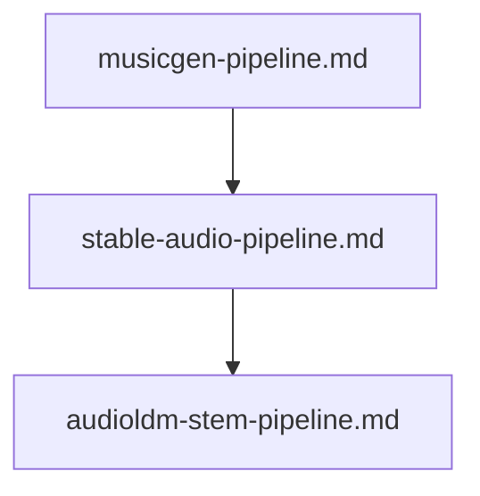

# 📖 🎵 Open-Weight Music & Audio Generation Prompts

This module contains specialized prompts for building music generation, audio diffusion, and stem separation pipelines as executable `.ipynb` Jupyter notebooks pulling open-weight models from HuggingFace (`transformers`, `diffusers`, `audiocraft`).

---

## 📋 Table of Contents
- [📁 Subcategories & Prompts](#-subcategories--prompts)
  - [🎤 Text-to-Music (`text-to-music/`)](#subcat-text-to-music) ([`📁 text-to-music/`](file:///home/sysadmin/Downloads/shed-prompts/music-generation/text-to-music/))
  - [🎛️ Audio Diffusion & Stem Processing (`audio-diffusion-stem/`)](#subcat-audio-diffusion-stem) ([`📁 audio-diffusion-stem/`](file:///home/sysadmin/Downloads/shed-prompts/music-generation/audio-diffusion-stem/))
- [⚡ Recommended Music Generation Pipeline](#pipeline)

---

## 📁 Subcategories & Prompts

### 🎤 Text-to-Music (`text-to-music/`)
| Prompt | Target Artifact | Description |
|---|---|---|
| [`musicgen-pipeline.md`](file:///home/sysadmin/Downloads/shed-prompts/music-generation/text-to-music/musicgen-pipeline.md) | `MUSICGEN_NOTEBOOK.ipynb` | Meta MusicGen text-to-music and audio-conditioned melody steering pipeline. |
| [`stable-audio-pipeline.md`](file:///home/sysadmin/Downloads/shed-prompts/music-generation/text-to-music/stable-audio-pipeline.md) | `STABLE_AUDIO_NOTEBOOK.ipynb` | Stable Audio Open text-to-audio diffusion and song composition pipeline. |
| [`music-arranger-prompt-suite.md`](file:///home/sysadmin/Downloads/shed-prompts/music-generation/text-to-music/music-arranger-prompt-suite.md) | `MUSIC_ARRANGER_SUITE.md` | Autonomous multi-section music prompt arranger, stem structuring agent, and acoustic parameter generator for MusicGen and Suno. |
| `[music-genre-prompt-auditor.md](file:///home/sysadmin/Downloads/shed-prompts/music-generation/text-to-music/music-genre-prompt-auditor.md)` | `MUSIC_GENRE_PROMPT_AUDITOR.md` | Autonomous genre/tempo/instrument prompt-fidelity auditor. |
| `[music-structure-sectioner.md](file:///home/sysadmin/Downloads/shed-prompts/music-generation/text-to-music/music-structure-sectioner.md)` | `MUSIC_STRUCTURE_SECTIONER.md` | Autonomous song-structure sectioner and arc checker. |

[⬆ Back to Top](#top)

---

### 🎛️ Audio Diffusion & Stem Processing (`audio-diffusion-stem/`)
| Prompt | Target Artifact | Description |
|---|---|---|
| [`audioldm-stem-pipeline.md`](file:///home/sysadmin/Downloads/shed-prompts/music-generation/audio-diffusion-stem/audioldm-stem-pipeline.md) | `AUDIOLDM_STEM_NOTEBOOK.ipynb` | AudioLDM 2 soundscape latent diffusion and Demucs multi-stem separation pipeline. |
| `[music-stem-separation-auditor.md](file:///home/sysadmin/Downloads/shed-prompts/music-generation/audio-diffusion-stem/music-stem-separation-auditor.md)` | `MUSIC_STEM_SEPARATION_AUDITOR.md` | Autonomous stem-separation quality auditor. |
| `[music-stem-loudness-normalizer.md](file:///home/sysadmin/Downloads/shed-prompts/music-generation/audio-diffusion-stem/music-stem-loudness-normalizer.md)` | `MUSIC_STEM_LOUDNESS_NORMALIZER.md` | Autonomous stem loudness (LUFS) normalizer. |

---

[⬆ Back to Top](#top)

---

## ⚡ Recommended Music Generation Pipeline

    Z0["music-stem-separation-auditor.md"]
    Z1["music-genre-prompt-auditor.md"]
    Z0 --> Z1
    Z2["music-structure-sectioner.md"]
    Z1 --> Z2
    Z3["music-stem-loudness-normalizer.md"]
    Z2 --> Z3

[⬆ Back to Top](#top)
