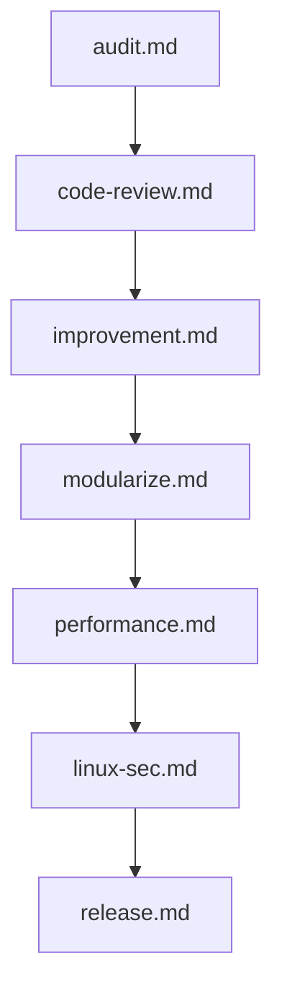

# 🧩 Natural Language Engineering Prompts

This module contains concise, direct-use prompts for autonomous codebase work. The suite is organized by the kind of engineering pass being requested: architecture and refactoring, quality and security review, performance and release operations, and focused reviews for AI, games, and notebooks. Each prompt is self-contained and keeps the original natural-language intent while adding a predictable workflow and output contract.

---

## 📋 Table of Contents
- [📁 Subcategories & Prompts](#-subcategories--prompts)
  - [🏛️ Architecture & Refactoring (`architecture-refactoring/`)](#subcat-architecture-refactoring) ([`📁 architecture-refactoring/`](file:///home/sysadmin/Downloads/shed-prompts/natural/architecture-refactoring/))
  - [🔒 Quality & Security (`quality-security/`)](#subcat-quality-security) ([`📁 quality-security/`](file:///home/sysadmin/Downloads/shed-prompts/natural/quality-security/))
  - [🚀 Operations & Performance (`ops-performance/`)](#subcat-ops-performance) ([`📁 ops-performance/`](file:///home/sysadmin/Downloads/shed-prompts/natural/ops-performance/))
  - [🧪 Specialized Reviews (`specialized-reviews/`)](#subcat-specialized-reviews) ([`📁 specialized-reviews/`](file:///home/sysadmin/Downloads/shed-prompts/natural/specialized-reviews/))
- [⚡ Recommended Natural Engineering Pipeline](#pipeline)

---

## 📁 Subcategories & Prompts

### 🏛️ Architecture & Refactoring (`architecture-refactoring/`)
| Prompt | Target Artifact | Description |
|---|---|---|
| [`improvement.md`](file:///home/sysadmin/Downloads/shed-prompts/natural/architecture-refactoring/improvement.md) | `CODE_STABILIZATION_REPORT.md` | Proactive stabilization pass for real logic bugs, race conditions, stale state, silent failures, and null-data crashes. |
| [`modularize.md`](file:///home/sysadmin/Downloads/shed-prompts/natural/architecture-refactoring/modularize.md) | `MODULARIZATION.md` | Behavioral-parity refactor that splits oversized files into cohesive modules and updates every call site. |

[⬆ Back to Top](#top)

---

### 🔒 Quality & Security (`quality-security/`)
| Prompt | Target Artifact | Description |
|---|---|---|
| [`audit.md`](file:///home/sysadmin/Downloads/shed-prompts/natural/quality-security/audit.md) | `CODEBASE_AUDIT.md` | Read-only audit of real bugs, correctness risks, crashes, silent failures, waste, and dead code. |
| [`code-review.md`](file:///home/sysadmin/Downloads/shed-prompts/natural/quality-security/code-review.md) | Direct review | Strict pull-request review focused on changed-code correctness, blast radius, regressions, tests, and safety. |
| [`linux-sec.md`](file:///home/sysadmin/Downloads/shed-prompts/natural/quality-security/linux-sec.md) | `LINUX_SECURITY_AUDIT.md` | Linux configuration and shell-script audit for privilege escalation, injection, unsafe permissions, isolation, and secrets. |
| [`webapp.md`](file:///home/sysadmin/Downloads/shed-prompts/natural/quality-security/webapp.md) | `WEBAPP_REVIEW.md` | Full-stack web application review covering frontend UX, backend/API integrity, state, authentication, and performance. |

[⬆ Back to Top](#top)

---

### 🚀 Operations & Performance (`ops-performance/`)
| Prompt | Target Artifact | Description |
|---|---|---|
| [`performance.md`](file:///home/sysadmin/Downloads/shed-prompts/natural/ops-performance/performance.md) | `PERFORMANCE_AUDIT.md` | Measurement-driven audit of hot paths, queries, I/O, rendering, payloads, memory, and cache invalidation. |
| [`release.md`](file:///home/sysadmin/Downloads/shed-prompts/natural/ops-performance/release.md) | `RELEASE_READINESS.md` | Production-readiness sweep for TODOs, stubs, mock data, broken routes, environment gaps, dependencies, builds, and tests. |

[⬆ Back to Top](#top)

---

### 🧪 Specialized Reviews (`specialized-reviews/`)
| Prompt | Target Artifact | Description |
|---|---|---|
| [`aichat-app.md`](file:///home/sysadmin/Downloads/shed-prompts/natural/specialized-reviews/aichat-app.md) | `AI_CHAT_APP_AUDIT.md` | LLM/chat application audit for streaming latency, RAG context, model resilience, prompt injection, and output safety. |
| [`game-dev.md`](file:///home/sysadmin/Downloads/shed-prompts/natural/specialized-reviews/game-dev.md) | `GAME_FEATURE_REVIEW.md` | Gameplay code review for frame budgets, state determinism, async races, memory, and layer coupling. |
| [`jupyter.md`](file:///home/sysadmin/Downloads/shed-prompts/natural/specialized-reviews/jupyter.md) | `JUPYTER_PRODUCTION_REVIEW.md` | Notebook production-readiness review for clean execution, data efficiency, reproducibility, and model artifact safety. |

---

[⬆ Back to Top](#top)

---

## ⚡ Recommended Natural Engineering Pipeline

Use `aichat-app.md`, `game-dev.md`, or `jupyter.md` as specialized branches whenever the target project requires an AI, gameplay, or notebook-specific review.

[⬆ Back to Top](#top)
