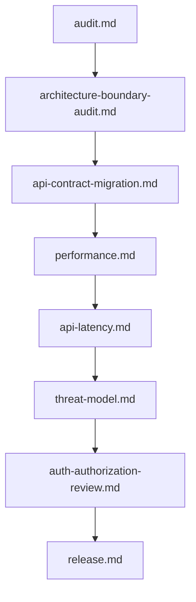

# 🧩 Natural Language Engineering Prompts

This module contains a direct-use suite of plain-language prompts for autonomous codebase work. Each prompt reads like a clear request to an experienced engineering partner: it explains the goal, what to examine, a practical approach, important guardrails, and the shape of the response. The prompts are organized by engineering activity: architecture and refactoring, quality and security, operations and performance, and focused reviews for specific platforms and system shapes.

---

## 📋 Table of Contents
- [📁 Subcategories & Prompts](#-subcategories--prompts)
  - [🏛️ Architecture & Refactoring (`architecture-refactoring/`)](#subcat-architecture-refactoring) ([`📁 architecture-refactoring/`](file:///home/sysadmin/Downloads/shed-prompts/natural/architecture-refactoring/))
  - [🔒 Quality & Security (`quality-security/`)](#subcat-quality-security) ([`📁 quality-security/`](file:///home/sysadmin/Downloads/shed-prompts/natural/quality-security/))
  - [🚀 Operations & Performance (`ops-performance/`)](#subcat-ops-performance) ([`📁 ops-performance/`](file:///home/sysadmin/Downloads/shed-prompts/natural/ops-performance/))
  - [🧪 Specialized Reviews (`specialized-reviews/`)](#subcat-specialized-reviews) ([`📁 specialized-reviews/`](file:///home/sysadmin/Downloads/shed-prompts/natural/specialized-reviews/))
- [⚡ Recommended Natural Engineering Pipeline](#pipeline)

---

## 📁 Subcategories & Prompts

### 🏛️ Architecture & Refactoring (`architecture-refactoring/`)
**12 prompts**

| Prompt | Target Artifact | Description |
|---|---|---|
| [`api-contract-migration.md`](file:///home/sysadmin/Downloads/shed-prompts/natural/architecture-refactoring/api-contract-migration.md) | `API_CONTRACT_MIGRATION.md` | Plans additive or breaking API and event contract migrations with consumer mapping, rollout sequencing, and rollback safety. |
| [`architecture-boundary-audit.md`](file:///home/sysadmin/Downloads/shed-prompts/natural/architecture-refactoring/architecture-boundary-audit.md) | `ARCHITECTURE_BOUNDARY_AUDIT.md` | Audits module and service boundaries, hidden coupling, dependency direction, and incremental refactoring risk. |
| [`dependency-graph-audit.md`](file:///home/sysadmin/Downloads/shed-prompts/natural/architecture-refactoring/dependency-graph-audit.md) | `DEPENDENCY_GRAPH_AUDIT.md` | Maps dependency cycles, coupling hubs, version skew, and ownership risks with an ordered remediation plan. |
| [`domain-modeling-review.md`](file:///home/sysadmin/Downloads/shed-prompts/natural/architecture-refactoring/domain-modeling-review.md) | `DOMAIN_MODEL_REVIEW.md` | Reviews business concepts, aggregates, invariants, terminology, and transaction boundaries for domain correctness. |
| [`event-driven-design.md`](file:///home/sysadmin/Downloads/shed-prompts/natural/architecture-refactoring/event-driven-design.md) | `EVENT_DRIVEN_DESIGN.md` | Reviews event-driven workflows for delivery guarantees, idempotency, schema evolution, replay, and failure recovery. |
| [`improvement.md`](file:///home/sysadmin/Downloads/shed-prompts/natural/architecture-refactoring/improvement.md) | `CODE_STABILIZATION_REPORT.md` | Proactive stabilization pass for real logic bugs, race conditions, stale state, silent failures, and null-data crashes. |
| [`interface-seam-audit.md`](file:///home/sysadmin/Downloads/shed-prompts/natural/architecture-refactoring/interface-seam-audit.md) | `INTERFACE_SEAM_AUDIT.md` | Audits interfaces, adapters, dependency injection, mocks, and lifecycle seams for leakage and test blind spots. |
| [`legacy-modernization.md`](file:///home/sysadmin/Downloads/shed-prompts/natural/architecture-refactoring/legacy-modernization.md) | `LEGACY_MODERNIZATION_PLAN.md` | Builds an incremental modernization roadmap using characterization tests, seams, strangler boundaries, and retirement gates. |
| [`modularize.md`](file:///home/sysadmin/Downloads/shed-prompts/natural/architecture-refactoring/modularize.md) | `MODULARIZATION.md` | Behavioral-parity refactor that splits oversized files into cohesive modules and updates every call site. |
| [`monolith-decomposition.md`](file:///home/sysadmin/Downloads/shed-prompts/natural/architecture-refactoring/monolith-decomposition.md) | `MONOLITH_DECOMPOSITION_PLAN.md` | Identifies viable monolith boundaries and stages extractions while accounting for data, consistency, deployment, and failure costs. |
| [`state-machine-review.md`](file:///home/sysadmin/Downloads/shed-prompts/natural/architecture-refactoring/state-machine-review.md) | `STATE_MACHINE_REVIEW.md` | Extracts and tests application state machines for invalid transitions, races, cancellation, persistence, and recovery gaps. |
| [`testability-refactor.md`](file:///home/sysadmin/Downloads/shed-prompts/natural/architecture-refactoring/testability-refactor.md) | `TESTABILITY_REFACTOR.md` | Adds minimal deterministic seams and behavioral tests around risky code without changing production semantics. |

[⬆ Back to Top](#top)

---

### 🔒 Quality & Security (`quality-security/`)
**14 prompts**

| Prompt | Target Artifact | Description |
|---|---|---|
| [`accessibility-review.md`](file:///home/sysadmin/Downloads/shed-prompts/natural/quality-security/accessibility-review.md) | `ACCESSIBILITY_REVIEW.md` | Reviews semantics, keyboard access, focus, assistive technology behavior, forms, motion, contrast, and recovery. |
| [`api-security-review.md`](file:///home/sysadmin/Downloads/shed-prompts/natural/quality-security/api-security-review.md) | `API_SECURITY_REVIEW.md` | Reviews API routes for authorization, validation, data exposure, abuse, rate control, replay, webhooks, and resource exhaustion. |
| [`audit.md`](file:///home/sysadmin/Downloads/shed-prompts/natural/quality-security/audit.md) | `CODEBASE_AUDIT.md` | Read-only audit of real bugs, correctness risks, crashes, silent failures, waste, and dead code. |
| [`auth-authorization-review.md`](file:///home/sysadmin/Downloads/shed-prompts/natural/quality-security/auth-authorization-review.md) | `AUTH_AUTHORIZATION_REVIEW.md` | Audits authentication, sessions, authorization, tenant isolation, tokens, administrative actions, and access-control tests. |
| [`code-review.md`](file:///home/sysadmin/Downloads/shed-prompts/natural/quality-security/code-review.md) | `N/A` | Strict pull-request review focused on changed-code correctness, blast radius, regressions, tests, and safety. |
| [`data-privacy-review.md`](file:///home/sysadmin/Downloads/shed-prompts/natural/quality-security/data-privacy-review.md) | `DATA_PRIVACY_REVIEW.md` | Reviews data collection, purpose, minimization, retention, deletion, sharing, analytics, logs, and privacy controls. |
| [`dependency-security.md`](file:///home/sysadmin/Downloads/shed-prompts/natural/quality-security/dependency-security.md) | `DEPENDENCY_SECURITY_AUDIT.md` | Audits direct and transitive dependencies for vulnerabilities, provenance, reachability, licensing, and safe upgrade paths. |
| [`incident-readiness.md`](file:///home/sysadmin/Downloads/shed-prompts/natural/quality-security/incident-readiness.md) | `INCIDENT_READINESS_REVIEW.md` | Reviews detection, escalation, runbooks, rollback, backups, failover, evidence preservation, and incident exercises. |
| [`input-validation-review.md`](file:///home/sysadmin/Downloads/shed-prompts/natural/quality-security/input-validation-review.md) | `INPUT_VALIDATION_REVIEW.md` | Audits untrusted input schemas, normalization, limits, injection risk, parser behavior, authorization, and safe output handling. |
| [`linux-sec.md`](file:///home/sysadmin/Downloads/shed-prompts/natural/quality-security/linux-sec.md) | `LINUX_SECURITY_AUDIT.md` | Linux configuration and shell-script audit for privilege escalation, injection, unsafe permissions, isolation, and secrets. |
| [`secrets-audit.md`](file:///home/sysadmin/Downloads/shed-prompts/natural/quality-security/secrets-audit.md) | `SECRETS_EXPOSURE_AUDIT.md` | Finds exposed credentials and sensitive configuration across code, history, CI, artifacts, logs, and runtime environments. |
| [`supply-chain-review.md`](file:///home/sysadmin/Downloads/shed-prompts/natural/quality-security/supply-chain-review.md) | `SUPPLY_CHAIN_REVIEW.md` | Reviews source, CI, dependencies, builders, artifacts, registries, signing, provenance, and deployment permissions. |
| [`threat-model.md`](file:///home/sysadmin/Downloads/shed-prompts/natural/quality-security/threat-model.md) | `THREAT_MODEL_REVIEW.md` | Builds a system-specific threat model with assets, trust boundaries, STRIDE threats, abuse cases, mitigations, and residual risk. |
| [`webapp.md`](file:///home/sysadmin/Downloads/shed-prompts/natural/quality-security/webapp.md) | `WEBAPP_REVIEW.md` | Full-stack web application review covering frontend UX, backend/API integrity, state, authentication, and performance. |

[⬆ Back to Top](#top)

---

### 🚀 Operations & Performance (`ops-performance/`)
**12 prompts**

| Prompt | Target Artifact | Description |
|---|---|---|
| [`api-latency.md`](file:///home/sysadmin/Downloads/shed-prompts/natural/ops-performance/api-latency.md) | `API_LATENCY_AUDIT.md` | Measures API latency and tail behavior across queues, code, dependencies, serialization, retries, and connection pools. |
| [`build-performance.md`](file:///home/sysadmin/Downloads/shed-prompts/natural/ops-performance/build-performance.md) | `BUILD_PERFORMANCE_AUDIT.md` | Profiles clean and incremental builds, critical paths, cache invalidation, CI variance, and reproducibility risks. |
| [`cache-strategy.md`](file:///home/sysadmin/Downloads/shed-prompts/natural/ops-performance/cache-strategy.md) | `CACHE_STRATEGY_REVIEW.md` | Reviews cache keys, scope, TTL, invalidation, stampede control, privacy boundaries, and correctness under failure. |
| [`database-performance.md`](file:///home/sysadmin/Downloads/shed-prompts/natural/ops-performance/database-performance.md) | `DATABASE_PERFORMANCE_AUDIT.md` | Audits database plans, indexes, transactions, locks, pools, replication, pagination, and data-distribution effects. |
| [`frontend-performance.md`](file:///home/sysadmin/Downloads/shed-prompts/natural/ops-performance/frontend-performance.md) | `FRONTEND_PERFORMANCE_AUDIT.md` | Audits frontend loading, rendering, interaction latency, bundles, hydration, layout stability, and device/network performance. |
| [`load-test-plan.md`](file:///home/sysadmin/Downloads/shed-prompts/natural/ops-performance/load-test-plan.md) | `LOAD_TEST_PLAN.md` | Designs safe load, spike, stress, and soak tests with realistic workloads, observability, guardrails, and SLO criteria. |
| [`memory-leak.md`](file:///home/sysadmin/Downloads/shed-prompts/natural/ops-performance/memory-leak.md) | `MEMORY_LEAK_AUDIT.md` | Investigates heap growth, retained object graphs, lifecycle cleanup, caches, native resources, and backpressure. |
| [`observability-review.md`](file:///home/sysadmin/Downloads/shed-prompts/natural/ops-performance/observability-review.md) | `OBSERVABILITY_REVIEW.md` | Audits metrics, logs, traces, SLO signals, alert quality, cardinality, cost, privacy, and incident diagnosability. |
| [`performance.md`](file:///home/sysadmin/Downloads/shed-prompts/natural/ops-performance/performance.md) | `PERFORMANCE_AUDIT.md` | Measurement-driven audit of hot paths, queries, I/O, rendering, payloads, memory, and cache invalidation. |
| [`release.md`](file:///home/sysadmin/Downloads/shed-prompts/natural/ops-performance/release.md) | `RELEASE_READINESS.md` | Production-readiness sweep for TODOs, stubs, mock data, broken routes, environment gaps, dependencies, builds, and tests. |
| [`resilience-review.md`](file:///home/sysadmin/Downloads/shed-prompts/natural/ops-performance/resilience-review.md) | `RESILIENCE_REVIEW.md` | Reviews failure handling, retries, timeouts, overload, degradation, restart behavior, recovery, and fault-test coverage. |
| [`resource-efficiency.md`](file:///home/sysadmin/Downloads/shed-prompts/natural/ops-performance/resource-efficiency.md) | `RESOURCE_EFFICIENCY_AUDIT.md` | Finds durable compute, storage, network, scheduling, and capacity waste while protecting reliability and compliance. |

[⬆ Back to Top](#top)

---

### 🧪 Specialized Reviews (`specialized-reviews/`)
**14 prompts**

| Prompt | Target Artifact | Description |
|---|---|---|
| [`aichat-app.md`](file:///home/sysadmin/Downloads/shed-prompts/natural/specialized-reviews/aichat-app.md) | `AI_CHAT_APP_AUDIT.md` | LLM/chat application audit for streaming latency, RAG context, model resilience, prompt injection, and output safety. |
| [`browser-extension.md`](file:///home/sysadmin/Downloads/shed-prompts/natural/specialized-reviews/browser-extension.md) | `BROWSER_EXTENSION_REVIEW.md` | Reviews browser extension permissions, contexts, messaging, storage, DOM access, lifecycle, and cross-browser behavior. |
| [`cli-tool.md`](file:///home/sysadmin/Downloads/shed-prompts/natural/specialized-reviews/cli-tool.md) | `CLI_TOOL_REVIEW.md` | Reviews CLI contracts, argument parsing, exit codes, streams, signals, filesystem safety, automation, and discoverability. |
| [`data-pipeline.md`](file:///home/sysadmin/Downloads/shed-prompts/natural/specialized-reviews/data-pipeline.md) | `DATA_PIPELINE_REVIEW.md` | Reviews data contracts, quality, idempotency, checkpoints, late data, retries, backfills, lineage, and privacy. |
| [`desktop-app.md`](file:///home/sysadmin/Downloads/shed-prompts/natural/specialized-reviews/desktop-app.md) | `DESKTOP_APPLICATION_REVIEW.md` | Reviews desktop lifecycle, IPC, local data, embedded content, updates, packaging, signing, performance, and accessibility. |
| [`distributed-system.md`](file:///home/sysadmin/Downloads/shed-prompts/natural/specialized-reviews/distributed-system.md) | `DISTRIBUTED_SYSTEM_REVIEW.md` | Reviews distributed-system guarantees across networks, replicas, clocks, partitions, coordination, deployments, and recovery. |
| [`game-dev.md`](file:///home/sysadmin/Downloads/shed-prompts/natural/specialized-reviews/game-dev.md) | `GAME_FEATURE_REVIEW.md` | Gameplay code review for frame budgets, state determinism, async races, memory, and layer coupling. |
| [`jupyter.md`](file:///home/sysadmin/Downloads/shed-prompts/natural/specialized-reviews/jupyter.md) | `JUPYTER_PRODUCTION_REVIEW.md` | Notebook production-readiness review for clean execution, data efficiency, reproducibility, and model artifact safety. |
| [`ml-pipeline.md`](file:///home/sysadmin/Downloads/shed-prompts/natural/specialized-reviews/ml-pipeline.md) | `ML_PIPELINE_REVIEW.md` | Reviews ML data lineage, leakage, reproducibility, training artifacts, serving parity, resource use, drift, and rollback. |
| [`mobile-app.md`](file:///home/sysadmin/Downloads/shed-prompts/natural/specialized-reviews/mobile-app.md) | `MOBILE_APPLICATION_REVIEW.md` | Reviews mobile lifecycle, state restoration, offline behavior, startup, resources, permissions, privacy, accessibility, and release risk. |
| [`rag-system.md`](file:///home/sysadmin/Downloads/shed-prompts/natural/specialized-reviews/rag-system.md) | `RAG_SYSTEM_REVIEW.md` | Reviews RAG ingestion, retrieval, reranking, context budgets, authorization, groundedness, freshness, latency, and cost. |
| [`realtime-system.md`](file:///home/sysadmin/Downloads/shed-prompts/natural/specialized-reviews/realtime-system.md) | `REALTIME_SYSTEM_REVIEW.md` | Reviews real-time connection lifecycle, delivery, ordering, resume, authorization, backpressure, fan-out, and resync. |
| [`serverless.md`](file:///home/sysadmin/Downloads/shed-prompts/natural/specialized-reviews/serverless.md) | `SERVERLESS_APPLICATION_REVIEW.md` | Reviews serverless invocation, retries, concurrency, cold starts, state, permissions, event contracts, cost, and observability. |
| [`webhook-integration.md`](file:///home/sysadmin/Downloads/shed-prompts/natural/specialized-reviews/webhook-integration.md) | `WEBHOOK_INTEGRATION_REVIEW.md` | Reviews webhook authenticity, schema validation, retries, duplicates, ordering, durable receipt, replay, and side effects. |

[⬆ Back to Top](#top)

---

## ⚡ Recommended Natural Engineering Pipeline

Use the specialized-review branch for platform-specific work. Combine prompts as needed; the suite is intentionally modular rather than a mandatory linear checklist.

[⬆ Back to Top](#top)
