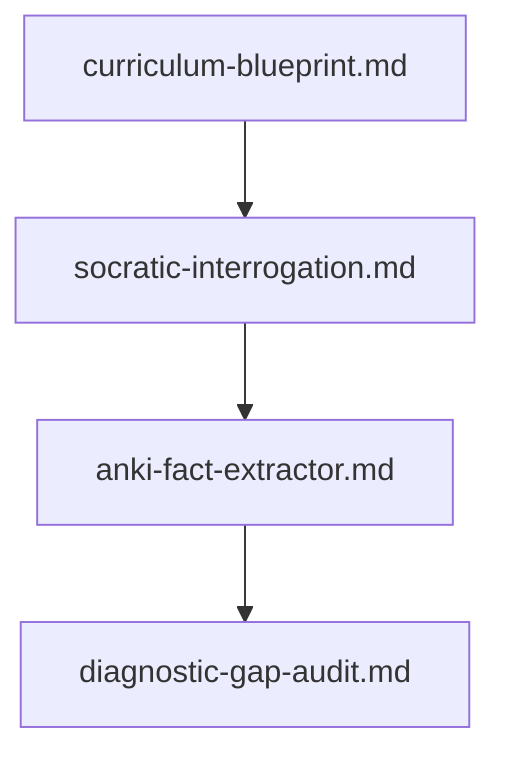

# 🎓 Accelerated Learning & Pedagogical Architecture Prompts

This domain transforms the AI into a master educator, pedagogical architect, and learning engineer. It deconstructs complex, dense technical subjects—such as compiler design, quantum mechanics, financial engineering, or distributed systems—into hyper-effective, structured learning pathways, interactive Socratic drills, high-yield spaced repetition decks, and diagnostic intuition audits.

---

## 📋 Table of Contents
- [📁 Subcategories & Prompts](#-subcategories--prompts)
  - [📐 Curriculum & Syllabus Blueprinting (`curriculum-design/`)](#subcat-curriculum-design) ([`📁 curriculum-design/`](file:///home/sysadmin/Downloads/shed-prompts/pedagogy-learning/curriculum-design/))
  - [🏛️ Socratic Probing & Mental Model Drills (`socratic-drills/`)](#subcat-socratic-drills) ([`📁 socratic-drills/`](file:///home/sysadmin/Downloads/shed-prompts/pedagogy-learning/socratic-drills/))
  - [🎴 Anki & Spaced Repetition Engineering (`flashcard-systems/`)](#subcat-flashcard-systems) ([`📁 flashcard-systems/`](file:///home/sysadmin/Downloads/shed-prompts/pedagogy-learning/flashcard-systems/))
  - [📊 Diagnostic Skill Gap Auditing (`skill-diagnostics/`)](#subcat-skill-diagnostics) ([`📁 skill-diagnostics/`](file:///home/sysadmin/Downloads/shed-prompts/pedagogy-learning/skill-diagnostics/))
- [⚡ Recommended Accelerated Learning Pipeline](#pipeline)

---

## 📁 Subcategories & Prompts

### 📐 Curriculum & Syllabus Blueprinting (`curriculum-design/`)
| Prompt | Target Artifact | Description |
|---|---|---|
| [`curriculum-blueprint.md`](file:///home/sysadmin/Downloads/shed-prompts/pedagogy-learning/curriculum-design/curriculum-blueprint.md) | `CURRICULUM_BLUEPRINT.md` | Deconstructing dense topics into progressive 4-week mastery roadmaps using Bloom's Taxonomy and deliberate practice principles. |

[⬆ Back to Top](#top)

---

### 🏛️ Socratic Probing & Mental Model Drills (`socratic-drills/`)
| Prompt | Target Artifact | Description |
|---|---|---|
| [`socratic-interrogation.md`](file:///home/sysadmin/Downloads/shed-prompts/pedagogy-learning/socratic-drills/socratic-interrogation.md) | `SOCRATIC_DRILL.md` | Interactive interrogation sessions testing first-principles understanding, Feynman Technique analogies, and knowledge gap discovery. |

[⬆ Back to Top](#top)

---

### 🎴 Anki & Spaced Repetition Engineering (`flashcard-systems/`)
| Prompt | Target Artifact | Description |
|---|---|---|
| [`anki-fact-extractor.md`](file:///home/sysadmin/Downloads/shed-prompts/pedagogy-learning/flashcard-systems/anki-fact-extractor.md) | `ANKI_FLASHCARDS.md` | Extracting high-yield atomic facts from textbooks or papers and formatting them into optimal double-sided Anki cards with cloze deletions. |
| [`spaced-repetition-deck-generator.md`](file:///home/sysadmin/Downloads/shed-prompts/pedagogy-learning/flashcard-systems/spaced-repetition-deck-generator.md) | `SPACED_REPETITION_DECK.md` | Autonomous learning content condenser and atomic cloze-deletion flashcard deck generator for Anki and SRS. |

[⬆ Back to Top](#top)

---

### 📊 Diagnostic Skill Gap Auditing (`skill-diagnostics/`)
| Prompt | Target Artifact | Description |
|---|---|---|
| [`diagnostic-gap-audit.md`](file:///home/sysadmin/Downloads/shed-prompts/pedagogy-learning/skill-diagnostics/diagnostic-gap-audit.md) | `SKILL_DIAGNOSTIC_AUDIT.md` | Generating targeted diagnostic exams evaluating problem-solving intuition rather than rote memory with mistake-pattern analysis. |

---

[⬆ Back to Top](#top)

---

## ⚡ Recommended Accelerated Learning Pipeline

[⬆ Back to Top](#top)
