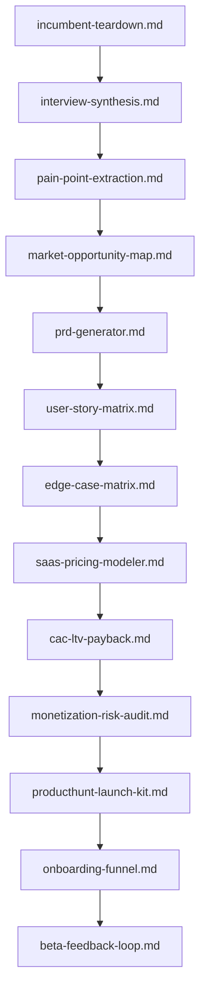

# 💡 Product Leadership & Venture Architecture Prompts

This module extends technical and narrative prompt sets into strategic product management, market analysis, and startup execution. Every prompt is engineered to run **autonomously with zero user input** — supplying the token `GENERATE` (or leaving input blank) triggers a complete, assumption-labeled deliverable. Prompts chain into a full venture pipeline: discover the market, specify the product, model the money, and launch it.

---

## 📋 Table of Contents
- [📁 Subcategories & Prompts](#-subcategories--prompts)
  - [🔭 Discovery & Competitive Intelligence (`discovery-intelligence/`)](#subcat-discovery-intelligence) ([`📁 discovery-intelligence/`](file:///home/sysadmin/Downloads/shed-prompts/product-venture/discovery-intelligence/))
  - [📐 PRD & Feature Specifications (`product-specs/`)](#subcat-product-specs) ([`📁 product-specs/`](file:///home/sysadmin/Downloads/shed-prompts/product-venture/product-specs/))
  - [💰 Unit Economics & Pricing Models (`monetization-pricing/`)](#subcat-monetization-pricing) ([`📁 monetization-pricing/`](file:///home/sysadmin/Downloads/shed-prompts/product-venture/monetization-pricing/))
  - [🚀 Go-to-Market & Launch Architecture (`gtm-launch/`)](#subcat-gtm-launch) ([`📁 gtm-launch/`](file:///home/sysadmin/Downloads/shed-prompts/product-venture/gtm-launch/))
- [⚡ Recommended Product Venture Pipeline](#pipeline)

---

## 📁 Subcategories & Prompts

### 🔭 Discovery & Competitive Intelligence (`discovery-intelligence/`)
| Prompt | Target Artifact | Description |
|---|---|---|
| [`incumbent-teardown.md`](file:///home/sysadmin/Downloads/shed-prompts/product-venture/discovery-intelligence/incumbent-teardown.md) | `INCUMBENT_TEARDOWN.md` | Autonomous reverse-engineering teardown of an incumbent product with wedge hypotheses. |
| [`interview-synthesis.md`](file:///home/sysadmin/Downloads/shed-prompts/product-venture/discovery-intelligence/interview-synthesis.md) | `INTERVIEW_SYNTHESIS.md` | Autonomous synthesis of user interviews into themes, personas, and opportunity statements. |
| [`pain-point-extraction.md`](file:///home/sysadmin/Downloads/shed-prompts/product-venture/discovery-intelligence/pain-point-extraction.md) | `PAIN_POINT_EXTRACTION.md` | Autonomous pain-point extraction, severity scoring, and prioritization matrix. |
| [`market-opportunity-map.md`](file:///home/sysadmin/Downloads/shed-prompts/product-venture/discovery-intelligence/market-opportunity-map.md) | `MARKET_OPPORTUNITY_MAP.md` | Autonomous TAM/SAM/SOM sizing, segment matrix, and whitespace opportunity portfolio. |

[⬆ Back to Top](#top)

---

### 📐 PRD & Feature Specifications (`product-specs/`)
| Prompt | Target Artifact | Description |
|---|---|---|
| [`prd-generator.md`](file:///home/sysadmin/Downloads/shed-prompts/product-venture/product-specs/prd-generator.md) | `PRD.md` | Autonomous PRD with INVEST user stories, acceptance criteria, edge-case matrix, and telemetry. |
| [`user-story-matrix.md`](file:///home/sysadmin/Downloads/shed-prompts/product-venture/product-specs/user-story-matrix.md) | `USER_STORY_MATRIX.md` | Autonomous user-story and acceptance-criteria matrix with sizing and dependency mapping. |
| [`edge-case-matrix.md`](file:///home/sysadmin/Downloads/shed-prompts/product-venture/product-specs/edge-case-matrix.md) | `EDGE_CASE_MATRIX.md` | Autonomous edge-case, abuse, and concurrency matrix with production telemetry spec. |

[⬆ Back to Top](#top)

---

### 💰 Unit Economics & Pricing Models (`monetization-pricing/`)
| Prompt | Target Artifact | Description |
|---|---|---|
| [`saas-pricing-modeler.md`](file:///home/sysadmin/Downloads/shed-prompts/product-venture/monetization-pricing/saas-pricing-modeler.md) | `SAAS_PRICING_TIERS.md` | Autonomous SaaS tier modeling, feature packaging, and upgrade-path design. |
| [`cac-ltv-payback.md`](file:///home/sysadmin/Downloads/shed-prompts/product-venture/monetization-pricing/cac-ltv-payback.md) | `CAC_LTV_PAYBACK.md` | Autonomous CAC/LTV computation, payback period, and churn sensitivity analysis. |
| [`monetization-risk-audit.md`](file:///home/sysadmin/Downloads/shed-prompts/product-venture/monetization-pricing/monetization-risk-audit.md) | `MONETIZATION_RISK_AUDIT.md` | Autonomous monetization strategy risk audit with resilience grading. |

[⬆ Back to Top](#top)

---

### 🚀 Go-to-Market & Launch Architecture (`gtm-launch/`)
| Prompt | Target Artifact | Description |
|---|---|---|
| [`producthunt-launch-kit.md`](file:///home/sysadmin/Downloads/shed-prompts/product-venture/gtm-launch/producthunt-launch-kit.md) | `PRODUCTHUNT_LAUNCH_KIT.md` | Autonomous Product Hunt / press-launch kit with 14-day cadence. |
| [`onboarding-funnel.md`](file:///home/sysadmin/Downloads/shed-prompts/product-venture/gtm-launch/onboarding-funnel.md) | `ONBOARDING_FUNNEL.md` | Autonomous onboarding funnel design with instrumentation and activation tests. |
| [`beta-feedback-loop.md`](file:///home/sysadmin/Downloads/shed-prompts/product-venture/gtm-launch/beta-feedback-loop.md) | `BETA_FEEDBACK_LOOP.md` | Autonomous beta program design with feedback triage and synthesis loop. |

---

[⬆ Back to Top](#top)

---

## ⚡ Recommended Product Venture Pipeline

[⬆ Back to Top](#top)
