# 📖 ⚙️ Safetensor Fine-Tuning Prompts

This domain provides specialized system prompts for setting up, executing, and deploying local fine-tuning workflows for `.safetensors` model weights (LLMs, Diffusion models, Vision-Language models) across three distinct operating system environments: **Linux**, **Windows**, and **macOS**. Each prompt acts as an expert AI engineer tailored to the unique driver stacks, memory architectures, framework backends, and OS-specific constraints of its target system.

---

## 📋 Table of Contents
- [📁 Subcategories & Prompts](#-subcategories--prompts)
  - [🐧 Linux Subcategory (`linux/`)](#subcat-linux) ([`📁 linux/`](file:///home/sysadmin/Downloads/shed-prompts/safetensor-fine-tuning/linux/))
  - [🪟 Windows Subcategory (`windows/`)](#subcat-windows) ([`📁 windows/`](file:///home/sysadmin/Downloads/shed-prompts/safetensor-fine-tuning/windows/))
  - [🍎 macOS Subcategory (`mac/`)](#subcat-mac) ([`📁 mac/`](file:///home/sysadmin/Downloads/shed-prompts/safetensor-fine-tuning/mac/))
- [⚡ Recommended Safetensor Fine-Tuning Pipeline](#pipeline)

---

## 📁 Subcategories & Prompts

### 🐧 Linux Subcategory (`linux/`)
| Prompt | Target Artifact | Description |
|---|---|---|
| [`linux-safetensor-env.md`](file:///home/sysadmin/Downloads/shed-prompts/safetensor-fine-tuning/linux/linux-safetensor-env.md) | `LINUX_SAFETENSOR_ENV.md` | Principal AI Infra Engineer configuring Linux CUDA/ROCm environments, driver stacks, PyTorch, xFormers, FlashAttention, and bitsandbytes for Safetensors fine-tuning. |
| [`linux-safetensor-pipeline.md`](file:///home/sysadmin/Downloads/shed-prompts/safetensor-fine-tuning/linux/linux-safetensor-pipeline.md) | `LINUX_SAFETENSOR_PIPELINE.md` | Senior ML Training Engineer orchestrating Linux LoRA/QLoRA and full parameter training pipelines, dataset tokenization, hyperparameters, and checkpointing for Safetensors models. |
| [`linux-safetensor-quantization.md`](file:///home/sysadmin/Downloads/shed-prompts/safetensor-fine-tuning/linux/linux-safetensor-quantization.md) | `LINUX_SAFETENSOR_QUANTIZATION.md` | Model Optimization Engineer handling adapter merging, safetensors integrity auditing, GGUF/EXL2/AWQ quantization, and local vLLM/Ollama inference validation on Linux. |
| [`safetensor-metadata-audit.md`](file:///home/sysadmin/Downloads/shed-prompts/safetensor-fine-tuning/linux/safetensor-metadata-audit.md) | `SAFETENSOR_METADATA_AUDIT.md` | Autonomous safetensor model weights inspector, tensor shape sanity checker, and quantization readiness auditor. |

[⬆ Back to Top](#top)

---

### 🪟 Windows Subcategory (`windows/`)
| Prompt | Target Artifact | Description |
|---|---|---|
| [`windows-safetensor-env.md`](file:///home/sysadmin/Downloads/shed-prompts/safetensor-fine-tuning/windows/windows-safetensor-env.md) | `WINDOWS_SAFETENSOR_ENV.md` | Windows AI Systems Engineer setting up WSL2 CUDA drivers, native PyTorch, Windows pagefile management, bitsandbytes-windows binaries, and C++ build tools for Safetensors fine-tuning. |
| [`windows-safetensor-pipeline.md`](file:///home/sysadmin/Downloads/shed-prompts/safetensor-fine-tuning/windows/windows-safetensor-pipeline.md) | `WINDOWS_SAFETENSOR_PIPELINE.md` | Windows ML Engineer configuring Kohya_ss, LLaMA-Factory, and web UI/CLI workflows for LoRA/QLoRA fine-tuning of Safetensors models under Windows memory limits. |
| [`windows-safetensor-quantization.md`](file:///home/sysadmin/Downloads/shed-prompts/safetensor-fine-tuning/windows/windows-safetensor-quantization.md) | `WINDOWS_SAFETENSOR_QUANTIZATION.md` | Windows Model Deployment Engineer merging LoRA adapters into base Safetensors, verifying tensor precision, executing llama.cpp GGUF conversion, and loading into LM Studio/Ollama on Windows. |

[⬆ Back to Top](#top)

---

### 🍎 macOS Subcategory (`mac/`)
| Prompt | Target Artifact | Description |
|---|---|---|
| [`mac-safetensor-env.md`](file:///home/sysadmin/Downloads/shed-prompts/safetensor-fine-tuning/mac/mac-safetensor-env.md) | `MAC_SAFETENSOR_ENV.md` | macOS Apple Silicon Systems Specialist configuring Metal Performance Shaders (MPS), MLX framework, sysctl unified memory limits, and Homebrew toolchains for Safetensors fine-tuning. |
| [`mac-safetensor-pipeline.md`](file:///home/sysadmin/Downloads/shed-prompts/safetensor-fine-tuning/mac/mac-safetensor-pipeline.md) | `MAC_SAFETENSOR_PIPELINE.md` | Apple Silicon ML Engineer executing MLX/LoRA and QLoRA fine-tuning workflows, dataset formatting, unified memory optimization, and MPS checkpointing for Safetensors models. |
| [`mac-safetensor-quantization.md`](file:///home/sysadmin/Downloads/shed-prompts/safetensor-fine-tuning/mac/mac-safetensor-quantization.md) | `MAC_SAFETENSOR_QUANTIZATION.md` | macOS Model Release Specialist merging MLX adapter weights into `.safetensors`, performing metal float precision audits, GGUF quantization via native llama.cpp, and Ollama/LM Studio deployment. |

---

[⬆ Back to Top](#top)

---

## ⚡ Recommended Safetensor Fine-Tuning Pipeline

```mermaid
graph TD
    subgraph Linux OS Workflow
        L1["linux-safetensor-env.md"] --> L2["linux-safetensor-pipeline.md"]
        L2 --> L3["linux-safetensor-quantization.md"]
    end

    subgraph Windows OS Workflow
        W1["windows-safetensor-env.md"] --> W2["windows-safetensor-pipeline.md"]
        W2 --> W3["windows-safetensor-quantization.md"]
    end

    subgraph macOS Workflow
        M1["mac-safetensor-env.md"] --> M2["mac-safetensor-pipeline.md"]
        M2 --> M3["mac-safetensor-quantization.md"]
    end
```

[⬆ Back to Top](#top)
