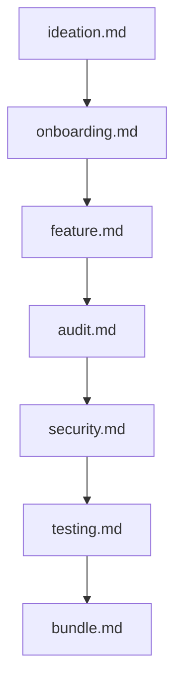

# 💻 Software & System Engineering Prompts

This module contains generalized software engineering, architecture, operations, product strategy, and security prompts applicable across web, backend, and desktop systems.

---

## 📁 Subcategories & Prompts

### 🏛️ Architecture & Refactoring (`architecture/`)
| Prompt | Target Artifact | Description |
|---|---|---|
| [`migration.md`](file:///home/sysadmin/Downloads/shed-prompts/software-engineering/architecture/migration.md) | `MIGRATION.md` | Major framework/language/runtime upgrades and breaking API contract migrations. |
| [`modularize.md`](file:///home/sysadmin/Downloads/shed-prompts/software-engineering/architecture/modularize.md) | `MODULARIZE.md` | Decomposing monolithic files or bloated modules into clean, decoupled packages. |
| [`schema.md`](file:///home/sysadmin/Downloads/shed-prompts/software-engineering/architecture/schema.md) | `SCHEMA_MIGRATION.md` | Zero-downtime database schema evolutions, shadow tables, and DDL migrations. |

### 🔒 Quality & Security (`quality-security/`)
| Prompt | Target Artifact | Description |
|---|---|---|
| [`a11y.md`](file:///home/sysadmin/Downloads/shed-prompts/software-engineering/quality-security/a11y.md) | `A11Y.md` | WCAG 2.1 AA accessibility compliance audit and DOM/UI remediation. |
| [`audit.md`](file:///home/sysadmin/Downloads/shed-prompts/software-engineering/quality-security/audit.md) | `AUDIT.md` | Read-only code quality, architecture consistency, and flaw audit. |
| [`audit-implementation.md`](file:///home/sysadmin/Downloads/shed-prompts/software-engineering/quality-security/audit-implementation.md) | Code Fixes | Active code remediation pass executing audit recommendations. |
| [`dependency.md`](file:///home/sysadmin/Downloads/shed-prompts/software-engineering/quality-security/dependency.md) | Code Updates | Security dependency upgrades, CVE remediation, and package auditing. |
| [`review.md`](file:///home/sysadmin/Downloads/shed-prompts/software-engineering/quality-security/review.md) | PR Feedback | Senior staff code review for pull requests and code diffs. |
| [`security.md`](file:///home/sysadmin/Downloads/shed-prompts/software-engineering/quality-security/security.md) | `SECURITY.md` | AppSec audit targeting injection, AuthN/AuthZ, secrets exposure, and CORS. |

### 🚀 Ops & Performance (`ops-performance/`)
| Prompt | Target Artifact | Description |
|---|---|---|
| [`bundle.md`](file:///home/sysadmin/Downloads/shed-prompts/software-engineering/ops-performance/bundle.md) | `BUNDLE_REPORT.md` | Production web bundle optimization, minification, and static distribution. |
| [`changelog.md`](file:///home/sysadmin/Downloads/shed-prompts/software-engineering/ops-performance/changelog.md) | `CHANGELOG.md` | Prepending consumer-focused release release notes from commit history. |
| [`i18n.md`](file:///home/sysadmin/Downloads/shed-prompts/software-engineering/ops-performance/i18n.md) | `I18N.md` | Codebase internationalization and multi-locale string extraction. |
| [`observability.md`](file:///home/sysadmin/Downloads/shed-prompts/software-engineering/ops-performance/observability.md) | `OBSERVABILITY.md` | Structured logging, OpenTelemetry metrics, and distributed tracing instrumentation. |
| [`performance.md`](file:///home/sysadmin/Downloads/shed-prompts/software-engineering/ops-performance/performance.md) | `PERFORMANCE.md` | Profiling-driven optimization for latency, CPU, throughput, and memory. |
| [`postmortem.md`](file:///home/sysadmin/Downloads/shed-prompts/software-engineering/ops-performance/postmortem.md) | `POSTMORTEM.md` | Blameless production incident postmortem with root cause analysis. |
| [`testing.md`](file:///home/sysadmin/Downloads/shed-prompts/software-engineering/ops-performance/testing.md) | Test Suite | Expanding unit, integration, and e2e test suites for regression prevention. |

### 💡 Product & Strategy (`product-strategy/`)
| Prompt | Target Artifact | Description |
|---|---|---|
| [`feature.md`](file:///home/sysadmin/Downloads/shed-prompts/software-engineering/product-strategy/feature.md) | Feature Code | Autonomous feature specification, scoping, and implementation pass. |
| [`ideation.md`](file:///home/sysadmin/Downloads/shed-prompts/software-engineering/product-strategy/ideation.md) | `IDEA_BUNDLE.md` | Portfolio concept generation, feasibility assessment, and product scoring. |
| [`improvement.md`](file:///home/sysadmin/Downloads/shed-prompts/software-engineering/product-strategy/improvement.md) | Code Fixes | Proactive code quality, DX, and refactoring pass without breaking API. |
| [`onboarding.md`](file:///home/sysadmin/Downloads/shed-prompts/software-engineering/product-strategy/onboarding.md) | `ONBOARDING.md` | Creating repository setup guides, architectural overview, and dev onboarding. |

---

## ⚡ Recommended Engineering Pipeline

