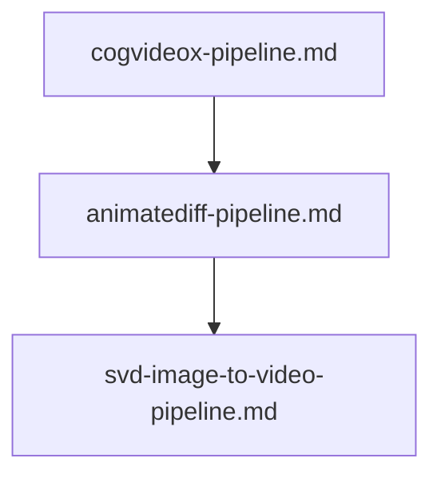

# 📖 🎬 Open-Weight Local Video Generation Prompts

This module contains specialized prompts for building open-weight text-to-video, image-to-video, and motion-conditioned synthesis pipelines as executable `.ipynb` Jupyter notebooks pulling models from HuggingFace (`diffusers`, `transformers`).

---

## 📋 Table of Contents
- [📁 Subcategories & Prompts](#-subcategories--prompts)
  - [📹 Text-to-Video (`text-to-video/`)](#subcat-text-to-video) ([`📁 text-to-video/`](file:///home/sysadmin/Downloads/shed-prompts/video-generation/text-to-video/))
  - [🎞️ Image-to-Video (`image-to-video/`)](#subcat-image-to-video) ([`📁 image-to-video/`](file:///home/sysadmin/Downloads/shed-prompts/video-generation/image-to-video/))
- [⚡ Recommended Video Generation Pipeline](#pipeline)

---

## 📁 Subcategories & Prompts

### 📹 Text-to-Video (`text-to-video/`)
| Prompt | Target Artifact | Description |
|---|---|---|
| [`cogvideox-pipeline.md`](file:///home/sysadmin/Downloads/shed-prompts/video-generation/text-to-video/cogvideox-pipeline.md) | `COGVIDEOX_NOTEBOOK.ipynb` | CogVideoX (2B/5B) 3D transformer text-to-video diffusers pipeline with 3D VAE slicing. |
| [`animatediff-pipeline.md`](file:///home/sysadmin/Downloads/shed-prompts/video-generation/text-to-video/animatediff-pipeline.md) | `ANIMATEDIFF_NOTEBOOK.ipynb` | AnimateDiff motion adapter pipeline with SD1.5 base and prompt travel keyframe animation. |
| [`video-storyboard-pipeline.md`](file:///home/sysadmin/Downloads/shed-prompts/video-generation/text-to-video/video-storyboard-pipeline.md) | `VIDEO_STORYBOARD_PIPELINE.md` | Autonomous multi-shot video storyboard generator and cinematic prompt suite for Sora, CogVideoX, and Runway Gen-2. |
| `[video-motion-coherence-auditor.md](file:///home/sysadmin/Downloads/shed-prompts/video-generation/text-to-video/video-motion-coherence-auditor.md)` | `VIDEO_MOTION_COHERENCE_AUDITOR.md` | Autonomous video motion-coherence and jitter auditor. |
| `[video-prompt-storyboard-auditor.md](file:///home/sysadmin/Downloads/shed-prompts/video-generation/text-to-video/video-prompt-storyboard-auditor.md)` | `VIDEO_PROMPT_STORYBOARD_AUDITOR.md` | Autonomous video prompt storyboard and continuity auditor. |

[⬆ Back to Top](#top)

---

### 🎞️ Image-to-Video (`image-to-video/`)
| Prompt | Target Artifact | Description |
|---|---|---|
| [`svd-image-to-video-pipeline.md`](file:///home/sysadmin/Downloads/shed-prompts/video-generation/image-to-video/svd-image-to-video-pipeline.md) | `SVD_IMAGE_TO_VIDEO_NOTEBOOK.ipynb` | Stable Video Diffusion (SVD-XT) image-to-video animation and motion bucket tuning pipeline. |
| `[video-frame-consistency-auditor.md](file:///home/sysadmin/Downloads/shed-prompts/video-generation/image-to-video/video-frame-consistency-auditor.md)` | `VIDEO_FRAME_CONSISTENCY_AUDITOR.md` | Autonomous image-to-video frame-consistency auditor. |

---

[⬆ Back to Top](#top)

---

## ⚡ Recommended Video Generation Pipeline

    Z0["video-motion-coherence-auditor.md"]
    Z1["video-prompt-storyboard-auditor.md"]
    Z0 --> Z1
    Z2["video-frame-consistency-auditor.md"]
    Z1 --> Z2

[⬆ Back to Top](#top)
