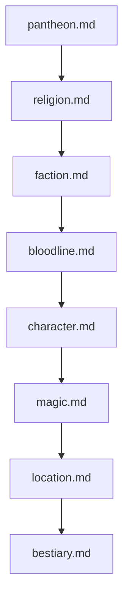

# ⚔️ Brutal Dark Medieval Fantasy Worldbuilding Prompts

This module contains specialized lore-building prompts designed for tabletop RPGs, narrative design, and worldbuilding in a **Brutal Dark Medieval Fantasy** setting.

---

## 📁 Subcategories & Prompts

### 🐉 Entities & Beings (`entities/`)
| Prompt | Target Artifact | Description |
|---|---|---|
| [`bestiary.md`](file:///home/sysadmin/Downloads/shed-prompts/worldbuilding/entities/bestiary.md) | Bestiary Entry | Clinical, biologically grounded creature/monster lore with in-universe artifact. |
| [`character.md`](file:///home/sysadmin/Downloads/shed-prompts/worldbuilding/entities/character.md) | Character Dossier | NPC, legendary figure, tyrant, or folk hero with fatal flaw and relationships. |

### 🏰 Factions & Beliefs (`factions-beliefs/`)
| Prompt | Target Artifact | Description |
|---|---|---|
| [`bloodline.md`](file:///home/sysadmin/Downloads/shed-prompts/worldbuilding/factions-beliefs/bloodline.md) | Dynasty Chronicle | Noble house, dynasty, or cursed lineage with hereditary trait and secrets. |
| [`faction.md`](file:///home/sysadmin/Downloads/shed-prompts/worldbuilding/factions-beliefs/faction.md) | Institutional Lore | Military order, merchant guild, cabal, or empire with internal schism. |
| [`pantheon.md`](file:///home/sysadmin/Downloads/shed-prompts/worldbuilding/factions-beliefs/pantheon.md) | Cosmic Lorebook | Deities, eldritch powers, divine hierarchy, and planar origin. |
| [`religion.md`](file:///home/sysadmin/Downloads/shed-prompts/worldbuilding/factions-beliefs/religion.md) | Theological Lore | Faith, church, cult, or heresy with dogma, rituals, and tithes. |

### 📜 Lore & Systems (`lore-systems/`)
| Prompt | Target Artifact | Description |
|---|---|---|
| [`artifact.md`](file:///home/sysadmin/Downloads/shed-prompts/worldbuilding/lore-systems/artifact.md) | Antiquarian Record | Relic, cursed weapon, or ancient mechanism with provenance and price. |
| [`event.md`](file:///home/sysadmin/Downloads/shed-prompts/worldbuilding/lore-systems/event.md) | War Chronicle | Historical battle, plague, siege, or cataclysm with tactical consequences. |
| [`location.md`](file:///home/sysadmin/Downloads/shed-prompts/worldbuilding/lore-systems/location.md) | Cartographic Record | Fortress, ruined city, dungeon, or region with environmental hazards. |
| [`magic.md`](file:///home/sysadmin/Downloads/shed-prompts/worldbuilding/lore-systems/magic.md) | Arcane Grimoire | Mechanically rigorous magic system defined by finite Source and Toll. |

---

## ⚡ Recommended Worldbuilding Campaign Pipeline

